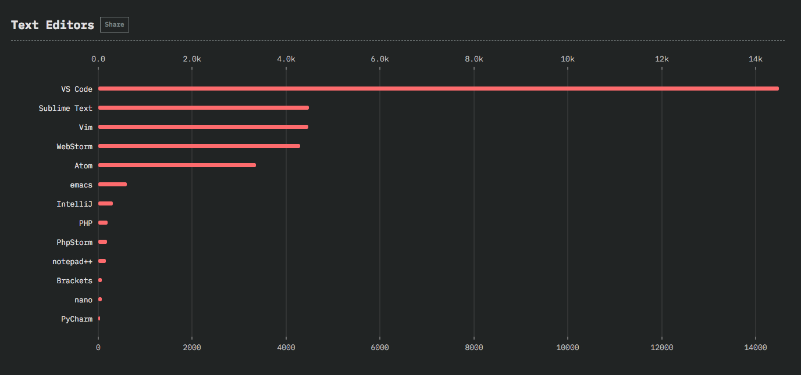

# 第5章-前端开发工具推荐

## 5.1 文档/API 浏览工具

**用于浏览常用开发人员文档和 API 参考文档的工具。**

* [Dash](https://kapeli.com/dash) \[OS X, iOS\]\[$\]
* [DevDocs](http://devdocs.io/)
* [Velocity](https://velocity.silverlakesoftware.com/) \[Windows\]\[$\]
* [Zeal](https://zealdocs.org/) \[Windows, Linux\]

**Cheatsheets:**

* [devhints.io](https://devhints.io/)

## 5.2 - SEO 工具Tools

**通用 SEO Tools:**

* [Keyword Tool](http://keywordtool.io/)
* [Google Webmasters Search Console](https://www.google.com/webmasters/)
* [Varvy SEO tool](https://varvy.com/tools/)

**查找 SEO 工具的工具:**

* [SEO 工具 - 完整列表](http://backlinko.com/seo-tools)
* [CuratedSEOTools - 最佳 SEO 工具精选](https://curatedseotools.com/)

## 5.3 原型 & 线框图工具

**设计:**

* [Axure](http://www.axure.com/) \[$\]
* [Balsamiq Mockups](https://balsamiq.com/) \[$\]
* [Justinmind](http://www.justinmind.com/) \[$\]
* [Moqups](https://moqups.com/) \[$\]
* [proto.io](https://proto.io/) \[$\]
* [UXPin](http://www.uxpin.com/) \[free to $\]

**合作 / 呈现:**

* [InVision](http://www.invisionapp.com/) \[free to $\]
* [Conceptboard](https://conceptboard.com/) \[free to $\]
* [myBalsamiq](https://balsamiq.cloud/) \[$\]
* [Marvel](https://marvelapp.com/) \[free to $\]

## 5.4 图标工具

* [draw.io](https://www.draw.io/) \[free to $\]
* [Cacoo](https://cacoo.com/) \[free to $\]
* [gliffy](https://www.gliffy.com/products/online/) \[free to $\]
* [sketchboard.io](https://sketchboard.io/) \[$\]

## 5.5 HTTP/网络工具

* [Charles](http://www.charlesproxy.com/) \[$\]
* [Chrome 开发者工具 Network Panel](https://developers.google.com/web/tools/chrome-devtools/profile/network-performance/resource-loading)
* [Insomnia](https://insomnia.rest/) \[free - $\]
* [Mitmproxy](https://mitmproxy.org/) \[free\]
* [Paw](https://paw.cloud/) \[$\]
* [Postman](https://www.getpostman.com/) \[free - $\]

## 5.6 代码编辑工具

> 源代码编辑器是专门为程序员编辑计算机程序源代码而设计的文本编辑器程序。它可以是一个独立的应用程序，也可以集成至到集成开发环境\(IDE\)或 Web 浏览器中。源代码编辑器是最基本的编程工具，程序员的基本工作就是编写和编辑源代码。
>
> — [Wikipedia](https://en.wikipedia.org/wiki/Source_code_editor)

前端代码可以通过一个简单的文本编辑应用程序（如记事本或 TextEdit）进行最低限度的编辑。但是，大多数前端实践者会选用专门用于编辑编程语言的代码编辑器。

代码编辑器有各种各样的类型，体积也大不相同。选择编辑器完全依赖于个人喜好。选择一个，并对其进行深入了解，然后学习 HTML、CSS、DOM 和 JavaScript。

然而，我坚信，代码编辑器至少应该具备以下品质（默认附带或通过插件实现）:

1. 关于如何使用编辑器的优质文档
2. 关于 HTML，CSS 和 JavaScript 的代码质量（即提示/ linting /错误）报告。 
3. 提供 HTML，CSS 和 JavaScript 语法高亮。 
4. 提供 HTML，CSS 和 JavaScript 的代码补全。 
5. 可通过插件系统进行自定义。
6. 有一个大型的第三方/社区插件仓库，可用于根据自己的喜好自定义编辑器。
7. 小巧，简单，不与代码耦合（即，不需要编辑代码）。

**代码编辑器:**

* [Atom](https://atom.io/)
* [Sublime Text](http://www.sublimetext.com/) \[$\]
* [WebStorm](https://www.jetbrains.com/webstorm/whatsnew/) \[$\]
* [Visual Studio Code](https://code.visualstudio.com/)

**在线代码编辑器:**

* [PaizaCloud](https://paiza.cloud/) \[free to $\]
* [AWS Cloud9](https://aws.amazon.com/cloud9/) \[$\]
* [Codeanywhere](https://codeanywhere.com/) \[free to $\]
* [StackBliz](https://stackblitz.com/)
* [codeSandbox](https://codesandbox.io/)

**可共享 & 运行的简单代码编辑器:**

用于共享有限数量的可立即运行的代码，不是真正的代码编辑器，而是可用于在 Web 浏览器中共享少量可立即执行的代码的工具。

* [CodePen](http://codepen.io/) \[free to $\]
* [jsbin.com](http://jsbin.com/) \[free to $\]
* [jsfiddle.net](http://jsfiddle.net/)
* [glitch](https://glitch.com/)

我建议使用 [Visual Studio Code](https://code.visualstudio.com/)，因为该工具的质量和对编辑器所做的持续改进目前不会因为微软的支持而降低或停止，而且在开发社区中非常受欢迎:

## 5.7 浏览器工具

**用于修复浏览器的 JS 工具:**

* [History.js](https://github.com/browserstate/history.js)
* [html2canvas](https://github.com/niklasvh/html2canvas)
* [Platform.js](https://github.com/bestiejs/platform.js)
* [URI.js](http://medialize.github.io/URI.js/)

**用于确定 X 浏览器是否支持 X 的参考工具：**

* \*\*\*\*[Browser support for broken/missing images](http://codepen.io/bartveneman/full/qzCte/)
* [Browserscope](http://www.browserscope.org/)
* [caniuse.com](http://caniuse.com/)
* [Firefox Platform Status - Implementation & standardization roadmap for web platform features](https://platform-status.mozilla.org/)
* [HTML5 Please](http://html5please.com/)
* [HTML5 Test](https://html5test.com/)
* [iwanttouse.com](http://www.iwanttouse.com/)
* [web-platform-tests dashboard](https://wpt.fyi/)
* [whatwebcando.today](https://whatwebcando.today/)

**浏览器开发/Debug 工具:**

* [Chrome Developer Tools \(aka DevTools\)](https://developers.google.com/web/tools/?hl=en)
  * [Per-Panel Documentation](https://developers.google.com/web/tools/chrome-devtools/#docs)
  * [Command Line API Reference](https://developers.google.com/web/tools/javascript/command-line/command-line-reference?hl=en)
  * [Keyboard & UI Shortcuts Reference](https://developers.google.com/web/tools/iterate/inspect-styles/shortcuts)
  * [Settings](https://developer.chrome.com/devtools/docs/settings)
* [Firefox Developer Tools](https://developer.mozilla.org/en-US/docs/Tools)
* [Safari Web Inspector](https://developer.apple.com/safari/tools/)
* [Vorlon.js](http://vorlonjs.com/)

**用于确定 X 浏览器是否支持 X 的 JavaScript 实用程序：**

* \*\*\*\*[Feature.js](http://featurejs.com/)
* [Modernizr](https://modernizr.com/)

**通用浏览器 Polyfills/Shims:**

* [console-polyfill](https://github.com/paulmillr/console-polyfill)
* [HTML5 Cross Browser Polyfills](https://github.com/Modernizr/Modernizr/wiki/HTML5-Cross-browser-Polyfills)
* [fetch](https://github.com/github/fetch)
* [socket.io](http://socket.io/)
* [SockJS](https://github.com/sockjs/sockjs-client)
* [webcomponents.js](https://github.com/WebComponents/webcomponentsjs)
* [webshim](https://afarkas.github.io/webshim/demos/)

**浏览器托管测试/自动化:**

* [Browserling](https://www.browserling.com/) \[free to $\]
* [BrowserStack](https://www.browserstack.com/) \[$\]
* [CrossBrowserTesting.com](http://crossbrowsertesting.com/) \[$\]
* [Ghost Inspector](https://ghostinspector.com/) \[free to $\]
* [Nightcloud.io](http://nightcloud.io/)
* [Sauce Labs](https://saucelabs.com/) \[$\]

**无头浏览器:**

* [slimerjs](http://slimerjs.org/)
* [Zombie.js](http://zombie.js.org/)
* [Headless Chromium](https://chromium.googlesource.com/chromium/src/+/lkgr/headless/README.md)

**浏览器自动化:**

用于功能测试与猴子测试。

* [CasperJS](http://casperjs.org/)
* [Nightmare](https://github.com/segmentio/nightmare)
* [TestCafe](https://github.com/DevExpress/testcafe)

**浏览器黑魔法:**

* [browserhacks.com](http://browserhacks.com/)

**浏览器同步工具:**

* [Browsersync](http://www.browsersync.io/)

**浏览器列表:**

Share target browsers between different front-end tools, like Autoprefixer, Stylelint and babel-preset-env.

* [Browserslist](https://github.com/ai/browserslist)
  * [http://browserl.ist/](http://browserl.ist/?q=%3E+2%25)

## 5.8 HTML 工具

**HTML 模板/入门套件：**

* [dCodes](http://www.dcodes.net/2/docs/index.html)
* [Email-Boilerplate](https://github.com/seanpowell/Email-Boilerplate)
* [HTML5 Boilerplate](https://html5boilerplate.com/)
* [HTML5 Bones](http://html5bones.com/)
* [Mobile boilerplate](https://html5boilerplate.com/mobile/)

**HTML Polyfill:**

* [html5shiv](https://github.com/aFarkas/html5shiv)

**转译:**

* [Pug](https://pugjs.org/api/getting-started.html)
* [Markdown](http://daringfireball.net/projects/markdown/)

**参考文档:**

* [Element attributes](https://html.spec.whatwg.org/multipage/indices.html#attributes-3)
* [Elements](https://html.spec.whatwg.org/multipage/indices.html#elements-3)
* [HTML Arrows](http://htmlarrows.com/)
* [HTML Entity Lookup](http://entity-lookup.leftlogic.com/)
* [htmlreference.io](http://htmlreference.io/)
* [HEAD - A free guide toelements](https://gethead.info/)

**Linting/Hinting:**

* [HTMLHint](https://htmlhint.io/)
* [html-inspector](https://github.com/philipwalton/html-inspector)

**优化工具:**

* [HTML Minifier](http://kangax.github.io/html-minifier/)

**在线创建/生成/实验工具:**

* [tablesgenerator.com](http://www.tablesgenerator.com/)

**书写规范:**

* [HTML Code Guide](http://codeguide.co/#html)
* [Principles of Writing Consistent, Idiomatic HTML](https://github.com/necolas/idiomatic-html)

**工作流:**

* [Emmet](http://emmet.io/)

**HTML Outliner:**

* [HTML 5 Outliner](https://gsnedders.html5.org/outliner/)

**本月 GitHhub 上 HTML 仓库流行趋势:**

[https://github.com/trending?l=html&since=monthly](https://github.com/trending?l=html&since=monthly)

## 5.9 CSS 工具

**CSS 通用工具:**

* [Basscss](http://basscss.com/)
* [Skeleton](http://getskeleton.com/)
* [Shed](http://tedconf.github.io/shed-css/)
* [Tailwind CSS](https://tailwindcss.com/)
* [Tachyons](https://github.com/tachyons-css/tachyons/)

**CSS 框架 \(通用工具 + UI\):**

* [Base](http://getbase.org/)
* [Bulma](http://bulma.io/)
* [Bootstrap 4](https://v4-alpha.getbootstrap.com/)
* [Concise](http://concisecss.com/)
* [Foundation](http://foundation.zurb.com/)
* [Material Design Lite \(MDL\)](http://www.getmdl.io/index.html)
* [Metro UI](http://metroui.org.ua/)
* [Mini.css](https://minicss.org/)
* [Mobi.css](http://getmobicss.com/)
* [Picnic](http://picnicss.com/)
* [Pure.css](http://purecss.io/)
* [Semantic UI](http://semantic-ui.com/)
* [Shoelace](https://shoelace.style/)
* [Spectre.css](https://picturepan2.github.io/spectre/)

**移动端 CSS 框架:**

* [Ratchet](http://goratchet.com/)

**CSS Reset:**

> CSS Reset（或“Reset CSS”）是一组简短的，经常压缩（缩小）的 CSS 规则集，用于将各个浏览器间 HTML 元素的样式统一起来。
>
> — [cssreset.com](http://cssreset.com/what-is-a-css-reset/)

* [Eric Meyer's “Reset CSS” 2.0](https://meyerweb.com/eric/tools/css/reset/)
* [Normalize](https://necolas.github.io/normalize.css/)
* [sanitize.css](https://github.com/jonathantneal/sanitize.css)

**转译:**

* [pleeease.io](http://pleeease.io/)
* [PostCSS](https://github.com/postcss/postcss) & [cssnext](http://cssnext.io/)
* [rework](https://github.com/reworkcss/rework) & [myth](http://www.myth.io/)

**参考文档:**

* [CSS Cursors](http://csscursor.info/)
* [css3test.com](http://css3test.com/)
* [css3clickchart.com](http://css3clickchart.com/)
* [cssreference.io](http://cssreference.io/)
* [CSS Indexes - A listing of every term defined by CSS specs](https://drafts.csswg.org/indexes/)
* [css4-selectors.com](http://css4-selectors.com/)
* [css4 Rocks](http://css4.rocks/)
* [CSS TRIGGERS...A GAME OF LAYOUT, PAINT, AND COMPOSITE](http://csstriggers.com/)
* [CSS Tricks Almanac](https://css-tricks.com/almanac/)
* [cssvalues.com](http://cssvalues.com/)
* [MDN CSS Reference](https://developer.mozilla.org/en-US/docs/Web/CSS/Reference)
* [CSS Cheat Sheet](https://adam-marsden.co.uk/css-cheat-sheet/)
* [What’s next for CSS?](https://cssdb.org/)

**Linting/Hinting:**

* [CSS Lint](http://csslint.net/)
* [stylelint](http://stylelint.io/)

**代码格式化/美化工具:**

* [CSScomb](https://github.com/csscomb/csscomb.js)
* [CSSfmt](https://github.com/morishitter/cssfmt)

**优化工具:**

* [clean-css](https://github.com/jakubpawlowicz/clean-css)
* [cssnano](http://cssnano.co/)
* [CSSO](http://css.github.io/csso/)
* [purgecss](https://github.com/FullHuman/purgecss)

**在线创建/生成/实验工具：**

* [CSS Arrow Please](http://cssarrowplease.com/)
* [CSS Matic](http://www.cssmatic.com/)
* [Enjoy CSS](http://enjoycss.com/)
* [flexplorer](http://bennettfeely.com/flexplorer/)
* [patternify.com](http://patternify.com/)
* [patternizer.com](http://patternizer.com/)
* [Ultimate CSS Gradient Generator](http://www.colorzilla.com/gradient-editor/)

**CSS 架构:**

* [Atomic Design](http://atomicdesign.bradfrost.com/) \[read\]
* [BEM](http://getbem.com/introduction/)
* [ITCSS](https://www.xfive.co/blog/itcss-scalable-maintainable-css-architecture/)
* [OOCSS](http://oocss.org/) \[read\]
* [SMACSS](https://smacss.com/) \[read\]\[$\]
  * [Scalable Modular Architecture for CSS \(SMACSS\)](https://frontendmasters.com/courses/smacss/) \[watch\]\[$\]
* [SUIT CSS](http://suitcss.github.io/)
* [rscss](http://rscss.io/)

**书写/架构规范:**

* [CSS code guide](http://codeguide.co/#css) \[read\]
* [css-architecture](https://github.com/jareware/css-architecture) \[read\]
* [cssguidelin.es](http://cssguidelin.es/) \[read\]
* [Idiomatic CSS](https://github.com/necolas/idiomatic-css) \[read\]
* [MaintainableCSS](http://maintainablecss.com/) \[read\]
* [Standards for Developing Flexible, Durable, and Sustainable HTML and CSS](http://mdo.github.io/code-guide/) \[read\]
* [Airbnb CSS / Sass Styleguide](https://github.com/airbnb/css) \[read\]

**风格指南资源:**

* [Frontify](https://frontify.com/) \[$\]
* [SC5 STYLE GUIDE GENERATOR](http://styleguide.sc5.io/)
* [styleguide-generators](https://github.com/davidhund/styleguide-generators)
* [Catalog](https://docs.catalog.style/)

**CSS in JS:**

* [styled components](https://www.styled-components.com/)
* [Emotion](https://emotion.sh/docs/introduction)
* [Radium](https://formidable.com/open-source/radium/)
* [Aphrodite](https://github.com/Khan/aphrodite)

**本月 GitHub CSS 仓库趋势:**

[https://github.com/trending?l=css&since=monthly](https://github.com/trending?l=css&since=monthly)

## 5.10 - DOM 工具

**DOM 库/框架:**

* [Bliss](http://blissfuljs.com/docs.html)
* [jQuery](http://jquery.com/)
  * [You Don't Need jQuery](https://github.com/oneuijs/You-Dont-Need-jQuery)
* [Zepto](http://zeptojs.com/)
* [cash](https://github.com/kenwheeler/cash/)
* [Umbrella JS](http://umbrellajs.com/)
* [nanoJS](https://vladocar.github.io/nanoJS/)

**DOM 通用工具:**

* [Keypress](http://dmauro.github.io/Keypress/)
* [Tether](http://tether.io/docs/welcome/)
* [clipboard.js](http://zenorocha.github.io/clipboard.js/)

**DOM 事件工具:**

* [Keyboard Event Viewer](http://w3c.github.io/uievents/tools/key-event-viewer.html)

**DOM 性能工具:**

* [Chrome DevTools Timeline](https://developers.google.com/web/tools/chrome-devtools/evaluate-performance/timeline-tool)
* [DOM Monster](http://mir.aculo.us/dom-monster/)

**参考文档:**

* [Events](https://html.spec.whatwg.org/#events-2)
* [DOM Browser Support](http://www.webbrowsercompatibility.com/dom/desktop/)
* [DOM Events Browser Support](http://www.webbrowsercompatibility.com/dom-events/desktop/)
* [HTML Interfaces Browser Support](http://www.webbrowsercompatibility.com/html-interfaces/desktop/)
* [MDN Document Object Model \(DOM\)](https://developer.mozilla.org/en-US/docs/Web/API/Document_Object_Model)
* [MDN Browser Object Model](https://developer.mozilla.org/en-US/docs/Web/API/Window)
* [MDN Document Object Model](https://developer.mozilla.org/en-US/docs/Web/API/Document_Object_Model)
* [MDN Event reference](https://developer.mozilla.org/en-US/docs/Web/Events)
* [MSDN Document Object Model \(DOM\)](https://msdn.microsoft.com/en-us/library/hh772384%28v=vs.85%29.aspx)

**DOM Polyfills/Shims:**

* [dom-shims](https://github.com/necolas/dom-shims)
* [Pointer Events Polyfill: a unified event system for the web platform](https://github.com/jquery/PEP)

**虚拟 DOM:**

* [jsdom](https://github.com/tmpvar/jsdom)
* [virtual-dom](https://github.com/Matt-Esch/virtual-dom)

## 5.11 - JavaScript 工具

**JS 常用库:**

* [accounting.js](http://openexchangerates.github.io/accounting.js/)
* [async](http://caolan.github.io/async/)
* [axios](https://github.com/mzabriskie/axios)
* [chance](http://chancejs.com/)
* [date-fns](https://date-fns.org/)
* [dinero](https://sarahdayan.github.io/dinero.js/module-Dinero.html)
* [Finance.js](http://financejs.org/)
* [format.js](http://formatjs.io/)
* [Howler.js](https://howlerjs.com/)
* [immutable](https://facebook.github.io/immutable-js/)
* [is.js](http://arasatasaygin.github.io/is.js/)
* [lodash](https://lodash.com/)
  * [You-Dont-Need-Lodash-Underscore](https://github.com/you-dont-need/You-Dont-Need-Lodash-Underscore)
* [Luxon](https://moment.github.io/luxon/)
  * [You don't \(may not\) need Moment.js](https://github.com/you-dont-need/You-Dont-Need-Momentjs)
* [Math.js](http://mathjs.org/)
* [Moment.js](http://momentjs.com/)
* [Numeral.js](http://numeraljs.com/)
* [Ramda](http://ramdajs.com/)
* [RxJS](http://reactivex.io/rxjs/)
* [TheoremJS](https://theorem.js.org/)
* [voca](https://vocajs.com/)
* [wait](https://github.com/elving/wait)
* [xregexp.com](http://xregexp.com/)

**转译至 JavaScript 对象的工具:**

* [transform-www](https://transform.now.sh/)

**转译 / 类型检查 \(ES 至 ES\):**

* [TypeScript](https://www.typescriptlang.org/)

**类型检查 \(ES 至 ES\):**

* [Flow](https://flowtype.org/)

**转译 \(ES 至 ES\):**

* [Babel](https://babeljs.io/)
* [sucrase](https://sucrase.io/)
* [scw](https://swc-project.github.io/)

**代码分析引擎:**

* [Tern](https://ternjs.net/)

**Linting/Hinting & Style Linter:**

* [eslint](http://eslint.org/)

**单元测试:**

* [AVA](https://github.com/avajs/ava)
* [Jasmine](http://jasmine.github.io/)
* [Mocha](http://mochajs.org/)
* [Tape](https://github.com/substack/tape)

**单元测试断言:**

* [Chai](http://chaijs.com/)
* [expect.js](https://github.com/Automattic/expect.js)
* [should.js](http://shouldjs.github.io/)

**Test Spies, Stubs, and Mocks for Unit Testing:**

* [sinon.js](http://sinonjs.org/)
* [Kakapo.js](http://devlucky.github.io/kakapo-js)

**代码格式化/美化工具:**

* [esformatter](https://github.com/millermedeiros/esformatter#esformatterformatstr-optsstring)
* [js-beautify](http://jsbeautifier.org/)
* [jsfmt](http://rdio.github.io/jsfmt/)
* [prettier](https://github.com/jlongster/prettier)

**性能测试:**

* [benchmark.js](http://benchmarkjs.com/)
* [jsperf.com](https://jsperf.com/)

**可视化, 静态分析, 复杂度, 覆盖率工具:**

* [Coveralls](https://coveralls.io/) \[$\]
* [Esprima](http://esprima.org/)
* [istanbul](https://github.com/gotwarlost/istanbul)

**优化工具:**

* [Closure Compiler](https://developers.google.com/closure/compiler/)
* [Terser](https://github.com/terser-js/terser)
* [optimize-js](https://github.com/nolanlawson/optimize-js)
* [Prepack](https://prepack.io/)

**代码混淆:**

* [Javascript Obfuscator](http://www.javascriptobfuscator.com/) \[free to $\]
* [JScrambler](https://jscrambler.com/) \[$\]

**可分享/运行代码编辑器:**

* [CodeSandbox](https://codesandbox.io/) \[free to $\]

**在线正则表达式编辑器/可视化工具:**

* [debuggex](https://www.debuggex.com/)
* [regex101](https://regex101.com/)
* [regexper](http://regexper.com/)
* [RegExr](http://regexr.com/)

**书写规范工具:**

* [Airbnb's ESLint config, following our styleguide](https://www.npmjs.com/package/eslint-config-airbnb)
* [Standard - ESLint Shareable Config](https://github.com/feross/eslint-config-standard)

**本月 GitHub JS 仓库趋势:**

[https://github.com/trending?l=javascript&since=monthly](https://github.com/trending?l=javascript&since=monthly)

**NPM 上最流行的依赖包:**

[https://www.npmjs.com/browse/depended](https://www.npmjs.com/browse/depended)

## 5.12 无头 CMS 工具

**站点生成器列表:**

* [headless CMS](https://headlesscms.org/)

## 5.13 静态站点生成工具

**站点生成器列表:**

* [staticgen.com](https://www.staticgen.com/)
* [staticsitegenerators.net](https://staticsitegenerators.net/)

#### 5.14 可用性工具 

**指南**

* [A11Y Style Guide](http://a11y-style-guide.com/style-guide/)
* [Accessibility Guidelines Checklist](http://accessibility.voxmedia.com/)
* [Interactive WCAG 2.0](http://code.viget.com/interactive-wcag/)
* [18F Accessibility Guide](https://pages.18f.gov/accessibility/checklist/)

**站点扫描器**

* [aXe Browser Extension](http://www.deque.com/products/axe/)
* [Chrome Accessibility Developer Tools](https://chrome.google.com/webstore/detail/accessibility-developer-t/fpkknkljclfencbdbgkenhalefipecmb)
* [Tenon Accessibility Tool](https://tenon.io/)
* [WAVE Accessibility Tool](http://wave.webaim.org/)

**对比色测试工具**

* [Colorable](http://jxnblk.com/colorable/demos/text/)
* [Colorable Matrix](http://jxnblk.com/colorable/demos/matrix/)
* [Color Safe](http://colorsafe.co/)
* [Color Ratio](http://leaverou.github.io/contrast-ratio/)

**低视力模拟器**

* [SEE](https://chrome.google.com/webstore/detail/see/dkihcccbkkakkbpikjmpnbamkgbjfdcn) \(Chrome\)
* [Spectrum](https://chrome.google.com/webstore/detail/spectrum/ofclemegkcmilinpcimpjkfhjfgmhieb) \(Chrome\)
* [NoCoffee](https://chrome.google.com/webstore/detail/nocoffee/jjeeggmbnhckmgdhmgdckeigabjfbddl) \(Chrome\)

**屏幕阅读器**

* [VoiceOver](http://www.apple.com/accessibility/) \(Mac\)
* [JAWS](http://www.freedomscientific.com/Products/Blindness/JAWS) \(Win\)
* [NVDA](https://www.nvaccess.org/) \(Win\)
* [ChromeVox](http://www.chromevox.com/) \(Chrome extension\)
* [Basic screen reader commands](https://www.paciellogroup.com/blog/2015/01/basic-screen-reader-commands-for-accessibility-testing/)

**可读性测试工具**

* [Expresso App](http://www.expresso-app.org/)
* [Hemingway App](http://www.hemingwayapp.com/)
* [Grammarly](https://www.grammarly.com/)
* [Readability Score](https://readability-score.com/text/)
* [MS Office](https://support.office.com/en-us/article/Test-your-document-s-readability-0adc0e9a-b3fb-4bde-85f4-c9e88926c6aa)

**文章**

* [Getting Started with ARIA](http://a11yproject.com/posts/getting-started-aria/)
* [Reframing Accessibility for the Web](http://alistapart.com/article/reframing-accessibility-for-the-web)
* [An Alphabet of Accessibility Issues](https://the-pastry-box-project.net/anne-gibson/2014-July-31)
* [Practical ARIA Examples](http://heydonworks.com/practical_aria_examples/)
* [MDN Accessibility Guide](https://developer.mozilla.org/en-US/docs/Learn/Accessibility)
* [Enable accessibility panel in Chrome dev tools](https://umaar.com/dev-tips/101-accessibility-inspection/)

## 5.15 应用框架 \(桌面端、移动端、平板电脑等\) 工具

**前端应用框架:**

* [AngularJS](https://github.com/angular/angular.js) \(i.e Angular 1.x.x\) + [Batarang](https://github.com/angular/angularjs-batarang)
* [Angular](https://github.com/angular/angular) \(i.e. Angular 2.0.0 +\) + [angular-cli](https://github.com/angular/angular-cli)
* [Aurelia](http://aurelia.io/) + [Aurelia CLI](https://github.com/aurelia/cli)
* [Ember](http://emberjs.com/) + [embercli](https://ember-cli.com/) + [Ember Inspector](https://chrome.google.com/webstore/detail/ember-inspector/bmdblncegkenkacieihfhpjfppoconhi?hl=en)
* [Polymer](https://www.polymer-project.org/1.0/)
* [React](http://facebook.github.io/react/) + [create-react-app](https://github.com/facebookincubator/create-react-app) + [React Developer Tools](https://chrome.google.com/webstore/detail/react-developer-tools/fmkadmapgofadopljbjfkapdkoienihi)
* [Vue.js](http://vuejs.org/) + [vue-cli](https://github.com/vuejs/vue-cli) & [Vue.js devtools](https://chrome.google.com/webstore/detail/vuejs-devtools/nhdogjmejiglipccpnnnanhbledajbpd?hl=en)
* [Riot](http://riotjs.com/)

**原生混合移动端 WebView（浏览器引擎驱动）框架:**

这些解决方案通常使用 [Cordova](https://cordova.apache.org/), [crosswalk](https://crosswalk-project.org/), 或自定义 WebView 作为原生 API 桥接工具.

* [ionic](http://ionicframework.com/)
* [onsen.io](http://onsen.io/)

**原生混合移动端 WebView（浏览器引擎驱动）环境/平台/工具:**

这些解决方案通常使用 [Cordova](https://cordova.apache.org/), [crosswalk](https://crosswalk-project.org/), 或自定义 WebView 作为原生 API 桥接工具.

* [Adobe PhoneGap](http://phonegap.com/) \[$\]
* [cocoon.io](https://cocoon.io/) \[free to $\]
* [ionic hub](http://ionic.io/) \[free to $\]
* [kony](http://www.kony.com/products/mobility-platform) \[$\]
* [Monaca](https://monaca.io/) \[$\]

**原生桌面端应用框架:**

* [Electron](http://electron.atom.io/)
* [NW.js](https://github.com/nwjs/nw.js)
* [proton](https://proton-native.js.org/#/)
* [Neutralino.js](https://neutralino.js.org/)
* [DeskGap](https://deskgap.com/)

**原生移动端应用框架 \(JavaScript 原生应用\)**

这些解决方案在运行时使用 JS 引擎以解释 JS 并将其桥接至本机API，不使用浏览器引擎或 WebView， UI 由原生 UI 组件组成。

* [Flutter](https://flutter.io/)
* [NativeScript](https://www.nativescript.org/)
* [React Native](https://facebook.github.io/react-native/)
* [tabris.js](https://tabrisjs.com/) \[free to $\]
* [trigger.io](https://trigger.io/how-it-works/) \[$\]
* [weex](https://weex.apache.org/)

**参考项目 & demo 应用:**

* [todomvc.com](http://todomvc.com/)
* [RealWorld example apps](https://github.com/gothinkster/realworld) \[code\]
* [Front-end Guidelines Questionnaire](https://github.com/bradfrost/frontend-guidelines-questionnaire)
* [Front-end Guidelines](https://github.com/bendc/frontend-guidelines)

**性能:**

* [js-framework-benchmark](https://github.com/krausest/js-framework-benchmark)
* [Front-End Performance Checklist 2019 \[PDF, Apple Pages, MS Word\]](https://www.smashingmagazine.com/2019/01/front-end-performance-checklist-2019-pdf-pages/) \[read\]

If you are new to front-end/JavaScript application development I'd start with [Vue.js](http://vuejs.org/). Then I'd work my way to [React](http://facebook.github.io/react/). Then I'd look at [Angular 2+](https://angular.io/), [Ember](http://emberjs.com/), or [Aurelia](http://aurelia.io/).

If you are building a simple website that has minimal interactions with data \(i.e. mostly a static content web site\), you should avoid a front-end framework. A lot of work can be done with a task runner like [Gulp and jQuery](https://github.com/vigetlabs/blendid), while avoiding the unnecessary complexity of learning and using an app framework tool.

Want something smaller than React, consider [Preact](https://preactjs.com/). Preact is an attempt to recreate the core value proposition of React \(or similar libraries like Mithril\) using as little code as possible, with first-class support for ES2015. Currently the library is around 3kb \(minified & gzipped\).

如果您不熟悉前端/JavaScript 应用开发，我建议从 [Vue.js](http://vuejs.org/) 开始，然后再转向 [React](http://facebook.github.io/react/)，最后了解一下 [Angular 2+](https://angular.io/)、[Ember](http://emberjs.com/) 或 [Aurelia](http://aurelia.io/)。

如果您正在构建一个与数据交互极少的简单网站（即主要是静态内容网站），则应避免使用前端框架。 使用像 [Gulp ](https://github.com/vigetlabs/blendid)这样的任务运行器[和 jQuery](https://github.com/vigetlabs/blendid) 可以完成很多工作，同时避免学习和使用应用框架工具所带来的不必要的复杂性。 

如果想要比 React 更简洁的东西，请考虑 [Preact](https://preactjs.com/)。 Preact 是尝试使用尽可能少的代码实现 React（或像Mithril这样的类似库）的核心价值，同时为 ES2015 提供最佳支持。 目前该库大约 3kb（精简并压缩过后）。

## 5.16 JavaScript 应用管理工具

* [JSUI](https://github.com/kitze/JSUI)

## 5.17 状态工具

* [Redux](https://redux.js.org/)
* [Mobx](https://mobx.js.org/)
* [mobx-state-tree](https://github.com/mobxjs/mobx-state-tree)
* [Cerebral](https://github.com/cerebral/cerebral)
* [freactal](https://github.com/FormidableLabs/freactal)
* [unistore](https://github.com/developit/unistore)
* [unstated](https://github.com/jamiebuilds/unstated)
* [Vuex](https://vuex.vuejs.org/en/)

## 5.18 渐进式 Web 应用（PWA）工具:

* [lighthouse](https://developers.google.com/web/tools/lighthouse/)
* [Progressive Web App Checklist](https://developers.google.com/web/progressive-web-apps/checklist)

## 5.19 GUI 开发/构建工具

* [CodeKit](http://incident57.com/codekit/)
* [Prepros](https://prepros.io/)
* [KoalaApp](http://koala-app.com/) \[free\]

## 5.20 模版/数据绑定工具

**仅模版:**

* [doT.js](http://olado.github.io/doT/)
* [art-template](https://aui.github.io/art-template/)
* [Nunjuncks](http://mozilla.github.io/nunjucks/)

**模版与动态数据绑定:**

* [ractive.js](https://ractive.js.org/)
* [react.js](https://facebook.github.io/react/index.html)
  * [preact](https://preactjs.com/)
  * [inferno](https://infernojs.org/)
  * [nerv](https://github.com/NervJS/nerv)
  * [rax](https://github.com/alibaba/rax)
* [riot](http://riotjs.com/)
* [Rivets.js](http://rivetsjs.com/)
* [vue.js](http://vuejs.org/)

**虚拟 DOM 模版:**

* [JSX](https://facebook.github.io/jsx/)

## 5.21 - UI 组件 & 组件工具箱

**Web 平台:**

* [Kendo UI](http://www.telerik.com/kendo-ui) for jQuery \[free to $\]
* [Materialize](http://materializecss.com/)
* [Office UI Fabric](http://dev.office.com/fabric)
* [Semantic UI](http://semantic-ui.com/)
* [UiKit](https://getuikit.com/)
* [Webix](http://webix.com/) \[$\]

**Web 平台，仅限 React:**

* [Ant Design](https://ant.design/)
* [Material ui](http://material-ui.com/)
* [Semantic-UI-React](https://react.semantic-ui.com/)
* [ExtReact](https://www.sencha.com/products/extreact/#app) \[$\]
* [Fabric](https://developer.microsoft.com/en-us/fabric)

**通过 Web 平台（即 NW.js 或 electronic）实现的原生桌面/笔记本/上网本应用程序:**

* \*\*\*\*[Photon](http://photonkit.com/)
* [React UI Components for OS X El Capitan and Windows 10](http://gabrielbull.github.io/react-desktop/)

If you need a basic set of UI Widgets/Components start with [Semantic UI](http://semantic-ui.com/). If you are building something that needs a grid, spreadsheet, or pivot grid you'll have to look at [Kendo UI](http://www.telerik.com/kendo-ui) or [Webix](http://webix.com/). Keep in mind that most of these solutions still require jQuery.

如果需要一套基础 UI 组件，建议从 [Semantic UI](http://semantic-ui.com/) 开始。如果您正在构建一些需要网格、电子表格或主网格的东西，则必须了解 [Kendo UI](http://www.telerik.com/kendo-ui) 或 [Webix](http://webix.com/)。记住，这些解决方案中的大多数仍然需要 jQuery。

## 5.22 数据可视化（图表）工具

**JS 库:**

* [d3](http://d3js.org/)
* [sigmajs](http://sigmajs.org/)

**组件:**

* [amCharts](http://www.amcharts.com/) \[free to $\]
* [AnyChart](http://www.anychart.com/) \[Non-commercial free to $\]
* [C3.js](http://c3js.org/)
* [Chartist-jsj](https://github.com/gionkunz/chartist-js)
* [Chart.js](http://www.chartjs.org/)
* [Epoch](http://epochjs.github.io/epoch/)
* [FusionCharts](http://www.fusioncharts.com/) \[$\]
* [Google Charts](https://developers.google.com/chart/interactive/docs/)
* [Highcharts](http://www.highcharts.com/) \[Non-commercial free to $\]
* [ZingChart](http://www.zingchart.com/) \[free to $\]

**服务（即可嵌入和共享的托管数据可视化服务）:**

* [ChartBlocks](http://www.chartblocks.com/) \[free to $\]
* [Datawrapper](https://datawrapper.de/)
* [infogr.am](https://infogr.am/) \[free to $\]
* [plotly](https://plot.ly/) \[free to $\]

## 5.23 图形化 \(SVG、canvas、webgl\) 工具

**通用:**

* [Fabric.js](http://fabricjs.com/)
* [Two.js](http://jonobr1.github.io/two.js/#introduction)

**Canvas:**

* [EaselJS](https://github.com/CreateJS/EaselJS)
* [Paper.js](http://paperjs.org/)

**SVG:**

* [d3](http://d3js.org/)
* [GraphicsJS](http://www.graphicsjs.org/)
* [Raphaël](http://dmitrybaranovskiy.github.io/raphael/)
* [Snap.svg](http://snapsvg.io/)
* [svg.js](http://svgjs.com/)

**WebGL:**

* [pixi.js](https://github.com/pixijs/pixi.js)
* [three.js](http://threejs.org/)

## 5.24 动画工具

**CSS 或 JavaScript 库:**

* [Animate Plus](https://github.com/bendc/animateplus)
* [Animate](https://github.com/daneden/animate.css)
* [Anime.js](http://animejs.com/)
* [Animista.net](http://animista.net/)
* [Dynamics.js](http://dynamicsjs.com/)
* [GreenSock-JS](http://greensock.com/)
* [Kute.js](http://thednp.github.io/kute.js/)
* [Magic](https://github.com/miniMAC/magic)
* [Micron.js](https://webkul.github.io/micron/)
* [Motion](http://mojs.io/)
* [TweenJS](https://github.com/CreateJS/TweenJS)
* [Popmotion](https://popmotion.io/)
* [Velocity.js](http://julian.com/research/velocity/)

**Polyfills/Shims:**

* [web-animations-js](https://github.com/web-animations/web-animations-js)

**动画兼容性参考:**

* [canianimate.com](http://canianimate.com/)

## 5.25 - JSON 工具

**在线编辑器:**

* [JSONmate](http://jsonmate.com/)
* [JSON Editor Online](https://jsoneditoronline.org/)

**格式化 & 验证工具:**

* [jsonformatter.org](http://jsonformatter.org/)
* [JSON Formatter & Validator](https://jsonformatter.curiousconcept.com/)

**查询工具:**

* [DefiantJS](http://www.defiantjs.com/)
* [JSON Mask](https://github.com/nemtsov/json-mask)
* [ObjectPath](http://objectpath.org/)

**JSON 模拟数据生成工具:**

* [JSON Generator](http://www.json-generator.com/)
* [Mockaroo](https://www.mockaroo.com/) \[free to $\]

**JSON API 在线模拟工具:**

* [FillText.com](http://www.filltext.com/)
* [FakeJSON](https://fakejson.com/) \[free to $\]
* [Jam API](https://github.com/dinubs/jam-api)
* [JSONPlaceholder](http://jsonplaceholder.typicode.com/)
* [jsonbin.io](https://jsonbin.io/)
* [jsonbin.org](https://jsonbin.org/)
* [mockable.io](https://www.mockable.io/)
* [mockapi.io](http://www.mockapi.io/)
* [Mocky](http://www.mocky.io/)
* [RANDOM USER GENERATOR](https://randomuser.me/)

**公共 JSON API 列表:**

* [A collective list of JSON APIs for use in web development](https://github.com/toddmotto/public-apis)

**本地 JSON API 模拟工具:**

* [json-server](https://github.com/typicode/json-server)

**JSON 规范/结构:**

* [json-schema.org](http://json-schema.org/) & [jsonschema.net](http://jsonschema.net/)
* [{json:api}](http://jsonapi.org/)

## 5.26 占位内容生成工具

**图片:**

* [placehold.it](http://placehold.it/)
* [Satyr](http://satyr.io/)
* [Placeimg](http://placeimg.com/)
* [Lorem Pixel](http://lorempixel.com/)
* [CSS-Tricks Image Resources](https://css-tricks.com/sites-with-high-quality-photos-you-can-use-for-free/)
* [LibreStock](http://librestock.com/)
* [Unsplash](https://unsplash.it/)

**设备模拟:**

* [placeit.net](https://placeit.net/)
* [mockuphone.com](http://mockuphone.com/)

**文字:**

* [Meet the Ipsums](http://meettheipsums.com/)
* [catipsum.com](http://www.catipsum.com/)
* [baconipsum.com](http://baconipsum.com/) \([API](http://baconipsum.com/json-api/)\)

**用户数据:**

* [uinames.com](https://uinames.com/)
* [randomuser.me](https://randomuser.me/)

## 5.27 测试工具

**软件测试框架:**

* [Intern](https://theintern.github.io/)
* [Jest](http://facebook.github.io/jest/)
  * [majestic](https://majestic.debuggable.io/)
  * [Enzyme](https://github.com/airbnb/enzyme)
  * [Cheerio](https://github.com/cheeriojs/cheerio)

**单元测试:**

* [AVA](https://github.com/avajs/ava)
* [Jasmine](http://jasmine.github.io/)
* [Mocha](http://mochajs.org/)
* [Tape](https://github.com/substack/tape)

**单元测试断言:**

* [Chai](http://chaijs.com/)
* [expect.js](https://github.com/Automattic/expect.js)
* [should.js](http://shouldjs.github.io/)

**Test Spies, Stubs, and Mocks for Unit Testing:**

* [sinon.js](http://sinonjs.org/)
* [Kakapo.js](http://devlucky.github.io/kakapo-js)

**浏览器托管/自动化测试:**

* [Browserling](https://www.browserling.com/) \[$\]
* [BrowserStack](https://www.browserstack.com/) \[$\]
* [CrossBrowserTesting.com](http://crossbrowsertesting.com/) \[$\]
* [Nightcloud.io](http://nightcloud.io/)
* [Sauce Labs](https://saucelabs.com/) \[$\]

**集成/功能测试:**

* [Cypress](https://www.cypress.io/)
* [Nightwatch](http://nightwatchjs.org/)
* [WebDriver.io](http://webdriver.io/)

**浏览器自动化:**

* [CasperJS](http://casperjs.org/)
* [Nightmare](https://github.com/segmentio/nightmare)
* [TestCafe](https://github.com/DevExpress/testcafe)

**UI 测试工具:**

* [gremlins.js](https://github.com/marmelab/gremlins.js)
* [Percy](https://percy.io/)
* [BackstopJS](https://github.com/garris/BackstopJS)
* [PhantomCSS](https://github.com/Huddle/PhantomCSS)
* [Ghost Inspector](https://ghostinspector.com/)
* [diff.io](https://diff.io/)

**死链接与错误自动监视器:**

* [Monkey Test It](https://monkeytest.it/)

**HTTP Stubbing**

* [Polly.JS](https://netflix.github.io/pollyjs/#/README)

## 5.28 - 前端数据存储工具 \(客户端数据存储方案\)

* [AlaSQL](http://alasql.org/)
* [Dexie.js](http://www.dexie.org/)
* [LocalForage](https://localforage.github.io/localForage/)
* [LokiJS](http://lokijs.org/#/)
* [Lovefield](https://google.github.io/lovefield)
* [lowdb](https://github.com/typicode/lowdb)
* [Pouchdb](http://pouchdb.com/)
* [NeDB](https://github.com/louischatriot/nedb)
* [RxDB](https://pubkey.github.io/rxdb/install.html)
* [ImmortalDB](https://github.com/gruns/ImmortalDB)

## 5.29 - 模块加载/构建工具

* [Parcel](https://parceljs.org/)
* [Rollup](http://rollupjs.org/)
  * [Microbundle](https://github.com/developit/microbundle)
* [webpack](https://webpack.js.org/)
  * [Poi](https://poi.js.org/)
  * [jetpack](https://github.com/KidkArolis/jetpack)
* [Fusebox](https://fuse-box.org/)
* [Browserify](http://browserify.org/)

## 5.30 模块/包管理工具

* [NPM](https://www.npmjs.com/)
* [yarn](https://yarnpkg.com/)
* [PNPM](https://pnpm.js.org/)

## 5.31 托管工具

**通用**

**General**

* [AWS](https://aws.amazon.com/websites/) \[$\]
* [DigitalOcean](https://digitalocean.com/) \[$\]
* [WebFaction](https://www.webfaction.com/) \[$\]

**静态**

* [Firebase Hosting](https://firebase.google.com/docs/hosting/) \[free to $\]
* [netlify](https://www.netlify.com/) \[free to $\]
  * [Bitballoon](https://www.bitballoon.com/)
* [Surge](https://surge.sh/) \[free to $\]
* [Forge](https://getforge.com/) \[$\]

## 5.32 - 项目管理 & 代码托管工具

* [Assembla](https://www.assembla.com/) \[free to $\]
* [Bitbucket](https://bitbucket.org/) \[free to $\]
* [Codebase](https://www.codebasehq.com/) \[$\]
* [Github](https://github.com/) \[free to $\]
* [GitLab](https://about.gitlab.com/) \[free to $\]
* [Unfuddle](https://unfuddle.com/) \[$\]

## 5.33 - 协作 & 沟通工具

* [Slack](https://slack.com/) & [screenhero](https://screenhero.com/) \[free to $\]
* [appear.in](https://appear.in/)
* [Mattermost](https://mattermost.org/) \[free to $\]

**代码/GitHub 协作 & 沟通:**

* [Gitter](https://gitter.im/) \[free to $\]

## 5.34 - 托管式内容管理/API 工具

**无头 CMS 工具:**

* [Contentful](https://www.contentful.com/) \[$\]
* [prismic.io](https://prismic.io/) \[free to $\]
* [Headless](https://www.headless.rest/)

**自托管无头 CMS Tools:**

* [Cockpit](https://getcockpit.com/)
* [Directus 7 App](https://directus.io/)

**托管式 CMS:**

* [LightCMS](https://www.lightcms.com/) \[$\]
* [Surreal CMS](http://www.surrealcms.com/) \[$\]

**静态 CMS Tools:**

* [webhook.com](http://www.webhook.com/)
* [Dato CMS](https://www.datocms.com/)
* [siteleaf](https://www.siteleaf.com/)
* [forestry.io](https://forestry.io/)

## 5.35 后端/API 工具

**数据/后端即服务（BAAS）:**

* [Backendless](https://backendless.com/)
* [Firebase](https://www.firebase.com/index.html) \[free to $\]
* [Pusher](https://pusher.com/) \[free to $\]
* [restdb.io](https://restdb.io/) \[free to $\]
* [MongoDB Stitch](https://www.mongodb.com/cloud/stitch)

**数据/后端**

* [GraphQL](http://graphql.org/)
  * [Apollo](http://www.apollodata.com/)
  * [Relay](https://facebook.github.io/relay/)
* [Falcor](https://netflix.github.io/falcor/)
* [RxDB](https://github.com/pubkey/rxdb)

**用户管理即服务:**

* [Auth0](https://auth0.com/) \[$\]
* [AuthRocket](https://authrocket.com/)
* [Okta](https://developer.okta.com/)

**搜索**

* [Algolia](https://www.algolia.com/)

## 5.36 脱机工具

* [Hoodie](http://hood.ie/)
* [Offline.js](http://github.hubspot.com/offline/docs/welcome/)
* [PouchDB](http://pouchdb.com/)
* [upup](https://www.talater.com/upup/)
* [Workbox](https://developers.google.com/web/tools/workbox/)

更多工具请查阅[这里](https://github.com/pazguille/offline-first#tools)。

## 5.37 安全工具

**编码工具:**

* [DOMPurify](https://github.com/cure53/DOMPurify)
* [XSS](http://jsxss.com/en/index.html)

**安全检测/评估/测试工具:**

* [Netsparker](https://www.netsparker.com/)
* [Websecurify](http://www.websecurify.com/)
* [OWASP ZAP](https://www.owasp.org/index.php/OWASP_Zed_Attack_Proxy_Project)

**参考文档:**

* [HTML5 Security Cheatsheet](https://html5sec.org/)

## 5.38 - 任务 \(构建\) 工具

**任务/构建工具:**

* [Gulp](http://gulpjs.com/)

**Opinionated Tasking / Build管道工具:**

* [Brunch](http://brunch.io/)

确保 [npm scripts](https://docs.npmjs.com/misc/scripts) 和 [yarn script](https://yarnpkg.com/en/docs/package-json#toc-scripts) 无法满足需求时再使用 Gulp，详情阅读 ["为什么我会为了 npm Scripts 放弃 Gulp 和 Grunt"](https://medium.freecodecamp.com/why-i-left-gulp-and-grunt-for-npm-scripts-3d6853dd22b8#.nw3huib54).

## 5.39 开发工具

* [Bamboo](https://www.atlassian.com/software/bamboo/) \[$\]
* [Buddy](https://buddy.works/) \[free to $\]
* [CircleCI](https://circleci.com/) \[free to $\]
* [Codeship](https://codeship.com/) \[free to $\]
* [Deploybot](https://deploybot.com/) \[free to $\]
* [Deployhq](https://www.deployhq.com/) \[free to $\]
* [FTPLOY](http://ftploy.com/) \[free to $\]
* [Now](https://zeit.co/now) \[free to $\]
* [Travis CI](http://docs.travis-ci.com/) \[free to $\]
* [Semaphore](https://semaphoreci.com/) \[free to $\]
* [Springloops](http://www.springloops.io/) \[free to $\]

## 5.40 站点/应用监控工具

**即时监控:**

* [Uptime Robot](https://uptimerobot.com/) \[free to $\]

**通用监控工具:**

* [Pingdom](https://www.pingdom.com/) \[free to $\]
* [New Relic](http://newrelic.com/)
* [Uptrends](https://www.uptrends.com/) \[$\]

## 5.41 JavaScript 错误报告/监控工具

* [bugsnag](https://bugsnag.com/) \[$\]
* [errorception](https://errorception.com/) \[$\]
* [Honeybadger](https://www.honeybadger.io/) \[$\]
* [Raygun](https://raygun.io/) \[$\]
* [Rollbar](https://rollbar.com/) \[free to $\]
* [Sentry](https://getsentry.com/welcome/) \[free to $\]
* [TrackJS](https://trackjs.com/) \[$\]

## 5.42 性能工具

**报告:**

* [bundlephobia.com](https://bundlephobia.com/)
* [GTmetrix](https://gtmetrix.com/)
* [sitespeed.io](https://www.sitespeed.io/)
* [Speed Curve](https://speedcurve.com/) \[$\]
* [Web Page Test](http://www.webpagetest.org/)
* [Sonarwhal](https://sonarwhal.com/)
* [webhint.io](https://webhint.io/)
* [Datadog](https://www.datadoghq.com/) \[$\]
* [Lighthouse](https://developers.google.com/web/tools/lighthouse/)

**JS 工具:**

* [imagemin](https://github.com/imagemin/imagemin)
* [ImageOptim-CLI](http://jamiemason.github.io/ImageOptim-CLI/)

**预算:**

* [performancebudget.io](http://www.performancebudget.io/)

**参考文献/文档:**

* [Jank Free](http://jankfree.org/)
* [Performance of ES6 features relative to the ES5](https://kpdecker.github.io/six-speed/)

**对照清单:**

* [The Front-End Checklist](https://frontendchecklist.io/)
* [Front-End Performance Checklist 2019 \[PDF, Apple Pages, MS Word\]](https://www.smashingmagazine.com/2019/01/front-end-performance-checklist-2019-pdf-pages/) \[read\]

## 5.43 用于查找工具的工具

* [built with](http://builtwith.com/)
* [frontendtools.com](http://frontendtools.com/)
* [javascripting.com](http://www.javascripting.com/)
* [js.coach](https://js.coach/)
* [JSter](http://jster.net/)
* [npms](https://npms.io/)
* [stackshare.io](http://stackshare.io/)
* [Unheap](http://www.unheap.com/)
* [bestof.js.org](https://bestof.js.org/)
* [libraries.io](https://libraries.io/)

## 5.44 文档生成工具

* [docz](https://www.docz.site/)
* [ESDoc](https://github.com/esdoc/esdoc)
* [JSDoc](http://usejsdoc.org/)
* [documentjs](https://documentjs.com/)

