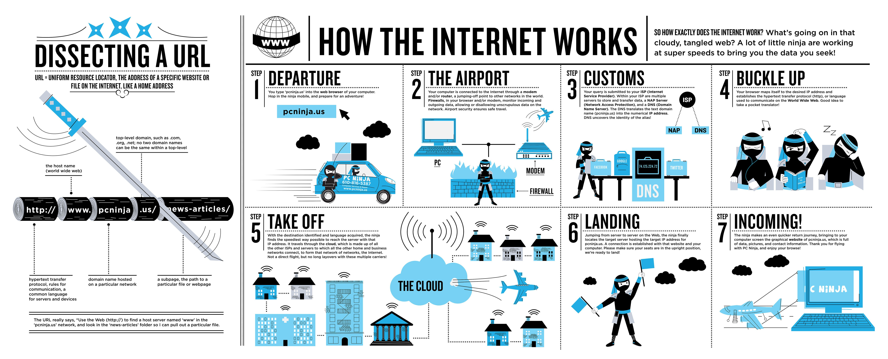
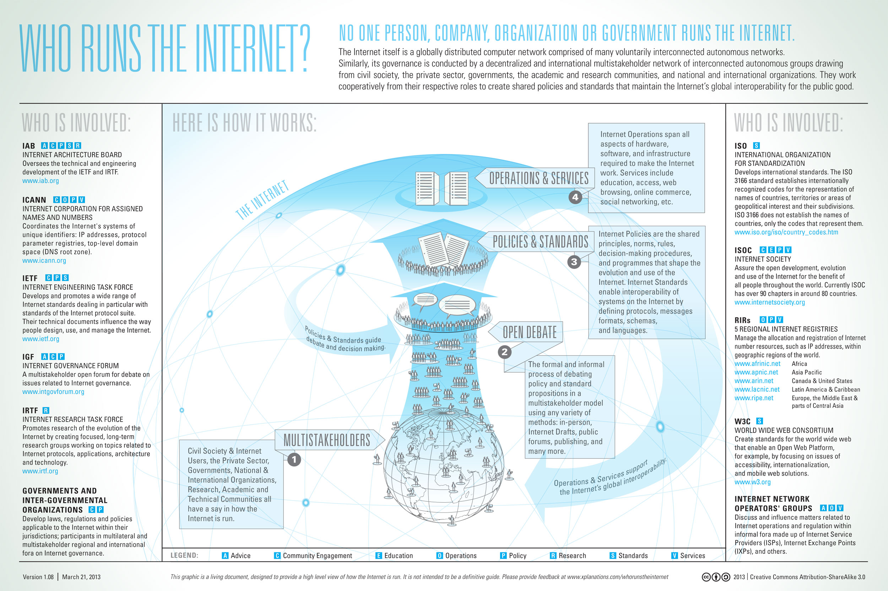
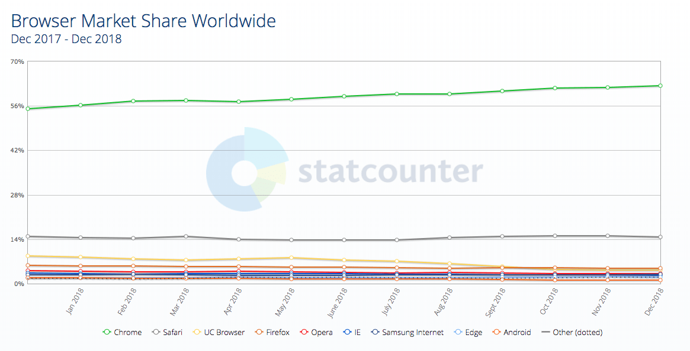

# 第3章-前端开发自学课程推荐

## 3.1 学习互联网 / Web

> 互联网是一个由相互连接的计算机网络组成的全球系统，使用 Internet 协议套件\(TCP/IP\)连接全世界数十亿的设备。它是由数百万个地方到全球范围的私有、公共、学术、商业和政府网络所组成的更大的网络，通过一系列广泛的电子、无线和光学网络技术连接在一起。Internet 承载着海量的信息资源和服务，例如超文本文档链接、万维网应用、电子邮件、电话和用于文件分享的对等网络。
>
> — [Wikipedi](https://en.wikipedia.org/wiki/Internet)

* [什么是互联网?](https://www.youtube.com/watch?v=Dxcc6ycZ73M) \[watch\]
* [互联网基础](http://internetfundamentals.com/) \[watch\]
* [Web 如何运作](https://developer.mozilla.org/en-US/docs/Learn/Getting_started_with_the_web/How_the_Web_works) \[read\]
* 互联网如何运作? [https://developer.mozilla.org/en-US/docs/Learn/Common\_questions/How\_does\_the\_Internet\_work](https://developer.mozilla.org/en-US/docs/Learn/Common_questions/How_does_the_Internet_work) 与 [http://web.stanford.edu/class/msande91si/www-spr04/readings/week1/InternetWhitepaper.htm](http://web.stanford.edu/class/msande91si/www-spr04/readings/week1/InternetWhitepaper.htm) \[read\]
* [互联网如何运作](https://www.khanacademy.org/partner-content/code-org/internet-works) \[watch\]
* [5分钟了解互联网如何运作](https://www.youtube.com/watch?v=7_LPdttKXPc) \[watch\]
* [Web 如何运作](https://www.eventedmind.com/classes/how-the-web-works-7f40254c) \[watch\]
* [什么是互联网? ](http://www.20thingsilearned.com/en-US/what-is-the-internet/1) \[read\]
* [无需畏惧互联网](http://www.dontfeartheinternet.com/)

## 3.2. - 学习浏览器

> Web 浏览器（通常称为浏览器）是用于在万维网上检索，呈现和遍历信息资源的软件应用程序。信息资源由统一资源标识符（URI / URL）标识，并且可以是网页，图像，视频或其他内容。资源中存在的超链接使用户能够轻松地将其浏览器导航到相关资源。虽然浏览器主要用于万维网，但它们也可用于访问私有网络中的 Web 服务器或文件系统中的文件所包含的信息。
>
> — [Wikipedia](https://en.wikipedia.org/wiki/Web_browser)

\*\*\*\*[**最常用的浏览器**](https://netmarketshare.com/?options=%7B%22filter%22%3A%7B%22%24and%22%3A%5B%7B%22deviceType%22%3A%7B%22%24in%22%3A%5B%22Desktop%2Flaptop%22%2C%22Mobile%22%5D%7D%7D%5D%7D%2C%22dateLabel%22%3A%22Trend%22%2C%22attributes%22%3A%22share%22%2C%22group%22%3A%22browser%22%2C%22sort%22%3A%7B%22share%22%3A-1%7D%2C%22id%22%3A%22browsersDesktop%22%2C%22dateInterval%22%3A%22Monthly%22%2C%22dateStart%22%3A%222018-01%22%2C%22dateEnd%22%3A%222018-12%22%2C%22segments%22%3A%22-1000%22%7D)**（客户端与移动端）:**

1. [Chrome](http://www.google.com/chrome/) \(内核: [Blink](https://en.wikipedia.org/wiki/Blink_%28layout_engine%29) + [V8](https://en.wikipedia.org/wiki/V8_%28JavaScript_engine%29)\)
2. [Firefox](https://www.mozilla.org/en-US/firefox/new/) \(内核: [Gecko](https://en.wikipedia.org/wiki/Gecko_%28software%29) + [SpiderMonkey](https://en.wikipedia.org/wiki/SpiderMonkey_%28software%29)\)
3. [Internet Explorer](http://windows.microsoft.com/en-us/internet-explorer/download-ie) \(内核: [Trident](https://en.wikipedia.org/wiki/Trident_%28layout_engine%29) + [Chakra](https://en.wikipedia.org/wiki/Chakra_%28JScript_engine%29)\)
4. [Safari](https://www.apple.com/safari/) \(内核: [Webkit](https://en.wikipedia.org/wiki/WebKit) + [SquirrelFish](https://trac.webkit.org/wiki/SquirrelFish)\)

**浏览器与 Web 技术（即API）的演变**

* \*\*\*\*[evolutionoftheweb.com](http://www.evolutionoftheweb.com/) \[read\]
* [Timeline of web browsers](https://en.wikipedia.org/wiki/Timeline_of_web_browsers) \[read\]

\*\*\*\*[**最常用的无头浏览器**](http://www.asad.pw/HeadlessBrowsers/)**:**

* [无头 Chromium](https://chromium.googlesource.com/chromium/src/+/lkgr/headless/README.md) \(内核: [Blink](https://www.chromium.org/blink) + V8\)
* [SlimerJS](http://slimerjs.org/) \(内核: [Gecko](https://en.wikipedia.org/wiki/Gecko_%28software%29) + [SpiderMonkey](https://en.wikipedia.org/wiki/SpiderMonkey_%28software%29)\)

**浏览器如何运作**

* [20 件我从浏览器与 Web 学到的事情](http://www.20thingsilearned.com/en-US/foreword/1) \[read\]
* [迅捷 CSS: 浏览器如何呈现 Web 页面](http://dbaron.org/talks/2012-03-11-sxsw/master.xhtml) \[read\]
* [浏览器如何运作: 深入现代浏览器](http://www.html5rocks.com/en/tutorials/internals/howbrowserswork/) \[read\]
* [Quantum 来了: 什么是浏览器内核?](https://hacks.mozilla.org/2017/05/quantum-up-close-what-is-a-browser-engine/)
* [浏览器如何渲染页面](https://www.youtube.com/watch?v=SmE4OwHztCc) \[watch\]
* [什么会触发重布局 / 回流](https://gist.github.com/paulirish/5d52fb081b3570c81e3a) \[read\]
* [每个前端开发者都应该知道的页面渲染知识](http://frontendbabel.info/articles/webpage-rendering-101/) \[read\]

**浏览器优化:**

* [浏览器渲染优化](https://www.udacity.com/course/browser-rendering-optimization--ud860) \[watch\]
* [网站性能优化](https://www.udacity.com/course/website-performance-optimization--ud884) \[watch\]

**浏览器对比**

* [Web 浏览器对比](https://en.wikipedia.org/wiki/Comparison_of_web_browsers) \[read\]

**浏览器黑魔法**

* [browserhacks.com](http://browserhacks.com/) \[read\]

**浏览器开发**

过去，前端开发人员在浏览器兼容上花了不少时间，这曾是一门非常重要的学科。今天，抽象（例如，React，Webpack，Post-CSS，Babel 等......）与现代浏览器的结合使浏览器开发变得相当容易。新的挑战不是用户使用什么浏览器，而是他们的浏览器运行在什么设备上。

**常青浏览器**

大部分现代浏览器的最新版本被认为是长青浏览器。也就是说，从理论上讲，它们应该在不提示用户的情况下进行自动更新。这种向自更新浏览器的转变是对淘汰不自动更新的旧浏览器的缓慢反作用。

**浏览器选择**

目前，大多数前端开发人员使用 Chrome 和“Chrome 开发者工具”来开发前端代码。然而，主流的现代浏览器都提供了各自风格的开发工具。可以根据个人喜好选择一个用于开发。更重要的问题是了解你需要支持哪些设备上的哪些浏览器，然后进行适当的测试。

#### 3.3 - Learn Domain Name System \(aka DNS\) 

> The Domain Name System \(DNS\) is a hierarchical distributed naming system for computers, services, or any resource connected to the Internet or a private network. It associates various information with domain names assigned to each of the participating entities. Most prominently, it translates domain names, which can be easily memorized by humans, to the numerical IP addresses needed for the purpose of computer services and devices worldwide. The Domain Name System is an essential component of the functionality of most Internet services because it is the Internet's primary directory service.
>
> — [Wikipedia](https://en.wikipedia.org/wiki/Domain_Name_System)

Image source: [http://www.digital-digest.com/blog/DVDGuy/wp-content/uploads/2011/11/how\_dns\_works.jpg](http://www.digital-digest.com/blog/DVDGuy/wp-content/uploads/2011/11/how_dns_works.jpg)

* [An Introduction to DNS Terminology, Components, and Concepts](https://www.digitalocean.com/community/tutorials/an-introduction-to-dns-terminology-components-and-concepts) \[read\]
* [DNS Explained](https://www.youtube.com/watch?v=72snZctFFtA) \[watch\]
* [How DNS Works](https://howdns.works/ep1/) \[read\]
* [The Internet: IP Addresses and DNS](https://www.youtube.com/watch?v=5o8CwafCxnU&index=3&list=PLzdnOPI1iJNfMRZm5DDxco3UdsFegvuB7) \[watch\]
* [What is a domain name?](https://developer.mozilla.org/en-US/docs/Learn/Common_questions/What_is_a_domain_name) \[read\]

#### 3.4 - Learn HTTP/Networks \(Including CORS & WebSockets\) 

> **HTTP** - The Hypertext Transfer Protocol \(HTTP\) is an application protocol for distributed, collaborative, hypermedia information systems. HTTP is the foundation of data communication for the World Wide Web.
>
> — [Wikipedia](https://en.wikipedia.org/wiki/Hypertext_Transfer_Protocol)

**HTTP Specifications**

* [HTTP/2](https://http2.github.io/)
* [Hypertext Transfer Protocol -- HTTP/1.1](https://tools.ietf.org/html/rfc2616)

**HTTP Docs**

* [MDN HTTP](https://developer.mozilla.org/en-US/docs/Web/HTTP) \[read\]

**HTTP Videos/Articles/Tutorials**

* [High Performance Browser Networking: What Every Web Developer Should Know About Networking and Web Performance](http://chimera.labs.oreilly.com/books/1230000000545/index.html) \[read\]
* [MDN: An overview of HTTP](https://developer.mozilla.org/en-US/docs/Web/HTTP/Overview) \[read\]
* [HTTP: The Definitive Guide \(Definitive Guides\)](https://www.amazon.com/HTTP-Definitive-Guide-Guides/dp/1565925092/ref=cm_cr_arp_d_product_top?&_encoding=UTF8&tag=frontend-handbook-20&linkCode=ur2&linkId=11b990b79d33ddbef63712765715a9c1&camp=1789&creative=9325) \[read\]\[$\]
* [HTTP/2 Frequently Asked Questions](https://http2.github.io/faq/#what-are-the-key-differences-to-http1x) \[read\]
* [HTTP Fundamentals](http://www.pluralsight.com/courses/xhttp-fund) \[watch\]\[$\]
* [HTTP/2 Fundamentals](https://app.pluralsight.com/library/courses/http2-fundamentals/table-of-contents) \[watch\]\[$\]
* [HTTP: The Protocol Every Web Developer Must Know - Part 1](http://code.tutsplus.com/tutorials/http-the-protocol-every-web-developer-must-know-part-1--net-31177) \[read\]
* [HTTP: The Protocol Every Web Developer Must Know - Part 2](http://code.tutsplus.com/tutorials/http-the-protocol-every-web-developer-must-know-part-2--net-31155) \[read\]
* [HTTP Succinctly](http://code.tutsplus.com/series/http-succinctly--net-33683) \[read\]

**HTTP Status Codes**

* [HTTP Status Codes](https://httpstatuses.com/)
* [HTTP Status Codes in 60 Seconds](http://webdesign.tutsplus.com/tutorials/http-status-codes-in-60-seconds--cms-24317) \[watch\]

> **CORS** - Cross-origin resource sharing \(CORS\) is a mechanism that allows restricted resources \(e.g., fonts\) on a web page to be requested from another domain outside the domain from which the resource originated.
>
> — [Wikipedia](https://en.wikipedia.org/wiki/Cross-origin_resource_sharing)

**CORS Specifications**

* [Cross-Origin Resource Sharing](https://www.w3.org/TR/cors/)

**CORS**

* [CORS in Action](https://www.amazon.com/CORS-Action-Creating-consuming-cross-origin/dp/161729182X/?&_encoding=UTF8&tag=frontend-handbook-20&linkCode=ur2&linkId=47ebd885d688a4ed69f77a1bd8273f8a&camp=1789&creative=9325) \[read\]\[$\]
* [HTTP Access Control \(CORS\)](https://developer.mozilla.org/en-US/docs/Web/HTTP/Access_control_CORS) \[read\]

> **WebSockets** - WebSocket is a protocol providing full-duplex communication channels over a single TCP connection. The WebSocket protocol was standardized by the IETF as RFC 6455 in 2011, and the WebSocket API in Web IDL is being standardized by the W3C.
>
> — [Wikipedia](https://en.wikipedia.org/wiki/WebSocket)

**WebSockets**

* [Connect the Web With WebSockets](https://code.tutsplus.com/courses/connect-the-web-with-websockets) \[watch\]
* [WebSocket: Lightweight Client-Server Communications](https://www.amazon.com/WebSocket-Client-Server-Communications-Andrew-Lombardi/dp/1449369278/?&_encoding=UTF8&tag=frontend-handbook-20&linkCode=ur2&linkId=dd39395cf3d2ab4fc7c820d7c19db39a&camp=1789&creative=9325) \[read\]\[$\]
* [The WebSocket Protocol](https://tools.ietf.org/html/rfc6455) \[read\]

#### 3.5 - Learn Web Hosting 

> A web hosting service is a type of Internet hosting service that allows individuals and organizations to make their website accessible via the World Wide Web. Web hosts are companies that provide space on a server owned or leased for use by clients, as well as providing Internet connectivity, typically in a data center.
>
> — [Wikipedia](https://en.wikipedia.org/wiki/Web_hosting_service)

**General Learning:**

* [Web Hosting 101: Get Your Website Live on the Web in No Time](https://www.udemy.com/web-hosting-101/) \[video\]

Image source: [https://firstsiteguide.com/wp-content/uploads/2016/06/what-is-web-hosting-infographic.jpg](https://firstsiteguide.com/wp-content/uploads/2016/06/what-is-web-hosting-infographic.jpg)

#### 3.6 - Learn General Front-End Development 

* [Frontend Bootcamp / Days in the Web](https://github.com/Microsoft/frontend-bootcamp) \[read\]
* [Becoming a Career-Ready Web Developer](https://frontendmasters.com/learn/beginner/)
* [Become a Front-End Web Developer](https://www.lynda.com/learning-paths/Web/become-a-front-end-web-developer) \[watch\]\[$\]
* [Being a web developer](http://www.yellowshoe.com.au/standards) \[read\]
* [freeCodeCamp](http://freecodecamp.com/) \[interact\]
  * [learning front-end development during \#100DaysOfCode \[read\]](https://github.com/nas5w/100-days-of-code-frontend#contibuting)
* [Front-End Web Developer Nanodegree](https://www.udacity.com/course/front-end-web-developer-nanodegree--nd001) \[watch\]\[$\]
* [Front End Web Development Career Kickstart](http://www.pluralsight.com/courses/front-end-web-development-career-kickstart) \[watch\]\[$\]
* [Front End Web Development: Get Started](http://www.pluralsight.com/courses/front-end-web-development-get-started) \[watch\]\[$\]
* [Front-End Web Development Quick Start With HTML5, CSS, and JavaScript](http://www.pluralsight.com/courses/front-end-web-app-html5-javascript-css) \[watch\]\[$\]
* [Front-End Web Development: The Big Nerd Ranch Guide](https://www.amazon.com/Front-End-Web-Development-Ranch-Guide/dp/0134433947/?&_encoding=UTF8&tag=frontend-handbook-20&linkCode=ur2&linkId=06802d4e42ca55b03294779c960d0826&camp=1789&creative=9325) \[read\]\[$\]
* [Complete Intro to Web Development](https://frontendmasters.com/courses/web-development-v2/) \[watch\]\[$\]
* [Learn Front End Web Development](https://teamtreehouse.com/tracks/front-end-web-development) \[watch\]\[$\]
* [So, You Want to Be a Front-End Engineer](https://www.youtube.com/watch?v=Lsg84NtJbmI) \[watch\]
* [codecademy.com: Web Development Path](https://www.codecademy.com/learn/paths/web-development) \[interact\]\[free to $\]
* [web.dev](https://web.dev/learn) \[read\]

#### 3.7 - Learn User Interface/Interaction Design 

> **User Interface Design** - User interface design \(UI\) or user interface engineering is the design of user interfaces for machines and software, such as computers, home appliances, mobile devices, and other electronic devices, with the focus on maximizing the user experience. The goal of user interface design is to make the user's interaction as simple and efficient as possible, in terms of accomplishing user goals \(user-centered design\).
>
> — [Wikipedia](https://en.wikipedia.org/wiki/User_interface_design)
>
> **Interaction Design Pattern** - A design pattern is a formal way of documenting a solution to a common design problem. The idea was introduced by the architect Christopher Alexander for use in urban planning and building architecture, and has been adapted for various other disciplines, including teaching and pedagogy, development organization and process, and software architecture and design.
>
> — [Wikipedia](https://en.wikipedia.org/wiki/Design_pattern)
>
> **User Experience Design** - User Experience Design \(UXD or UED or XD\) is the process of enhancing user satisfaction by improving the usability, accessibility, and pleasure provided in the interaction between the user and the product. User experience design encompasses traditional human–computer interaction \(HCI\) design, and extends it by addressing all aspects of a product or service as perceived by users.
>
> — [Wikipedia](https://en.wikipedia.org/wiki/User_experience_design)
>
> **Human–Computer Interaction** - Human–computer interaction \(HCI\) researches the design and use of computer technology, focusing particularly on the interfaces between people \(users\) and computers. Researchers in the field of HCI both observe the ways in which humans interact with computers and design technologies that lets humans interact with computers in novel ways.
>
> — [Wikipedia](https://en.wikipedia.org/wiki/Human%E2%80%93computer_interaction)

Minimally I'd suggest reading the following canonical texts on the matter so one can support and potential build usable user interfaces.

* [About Face: The Essentials of Interaction Design](https://www.amazon.com/About-Face-Essentials-Interaction-Design-ebook/dp/B00MFPZ9UY/?&_encoding=UTF8&tag=frontend-handbook-20&linkCode=ur2&linkId=c723c84ad4d246cb7f1c4a737c5f38a4&camp=1789&creative=9325) \[read\]\[$\]
* [Design for Hackers: Reverse Engineering Beauty](https://www.amazon.com/Design-Hackers-Reverse-Engineering-Beauty/dp/1119998956/?&_encoding=UTF8&tag=frontend-handbook-20&linkCode=ur2&linkId=2a52f0968de21c03f069d857b9d92b37&camp=1789&creative=9325) \[read\]\[$\]
* [Design for Non-Designers](https://www.youtube.com/watch?v=ZbrzdMaumNk&feature=youtu.be) \[watch\]
* [Designing Interfaces](https://www.amazon.com/Designing-Interfaces-Jenifer-Tidwell/dp/1449379702/?&_encoding=UTF8&tag=frontend-handbook-20&linkCode=ur2&linkId=4539707bb145c676472472aab25eaa56&camp=1789&creative=9325) \[read\]\[$\]
* [Designing Web Interfaces: Principles and Patterns for Rich Interactions](https://www.amazon.com/Designing-Web-Interfaces-Principles-Interactions-ebook/dp/B0026OR33U/?&_encoding=UTF8&tag=frontend-handbook-20&linkCode=ur2&linkId=03fb59f4a4345732fae9ecdfaa5076ae&camp=1789&creative=9325) \[read\]\[$\]
* [Don't Make Me Think, Revisited: A Common Sense Approach to Web Usability](https://www.amazon.com/Dont-Make-Think-Revisited-Usability/dp/0321965515/?&_encoding=UTF8&tag=frontend-handbook-20&linkCode=ur2&linkId=8b0b0771a9985e4e030ef1fe29cf6409&camp=1789&creative=9325) \[read\]\[$\]

#### 3.8 - Learn HTML & CSS 

> **HTML** - HyperText Markup Language, commonly referred to as HTML, is the standard markup language used to create web pages. Web browsers can read HTML files and render them into visible or audible web pages. HTML describes the structure of a website semantically along with cues for presentation, making it a markup language, rather than a programming language.
>
> — [Wikipedia](https://en.wikipedia.org/wiki/HTML)
>
> **CSS** - Cascading Style Sheets \(CSS\) is a style sheet language used for describing the look and formatting of a document written in a markup language. Although most often used to change the style of web pages and user interfaces written in HTML and XHTML, the language can be applied to any kind of XML document, including plain XML, SVG and XUL. Along with HTML and JavaScript, CSS is a cornerstone technology used by most websites to create visually engaging webpages, user interfaces for web applications, and user interfaces for many mobile applications.
>
> — [Wikipedia](https://en.wikipedia.org/wiki/Cascading_Style_Sheets)

Liken to constructing a house, one might consider HTML the framing and CSS to be the painting & decorating.

**General Learning:**

* [Absolute Centering in CSS](http://codepen.io/shshaw/full/gEiDt) \[read\]
* [CSS Positioning](http://www.pluralsight.com/courses/css-positioning-1834) \[watch\]\[$\]
* [Introduction to Web Development \(v2\)](https://frontendmasters.com/courses/web-development-v2/) \[watch\]\[$\]
* [Front End Web Development: Get Started](http://www.pluralsight.com/courses/front-end-web-development-get-started) \[watch\]\[$\]
* [Front-End Web Development Quick Start With HTML5, CSS, and JavaScript](http://www.pluralsight.com/courses/front-end-web-app-html5-javascript-css) \[watch\]\[$\]
* [HTML and CSS: Design and Build Websites](https://www.amazon.com/gp/product/1118008189/?&_encoding=UTF8&tag=frontend-handbook-20&linkCode=ur2&linkId=b1c45ab715f267f7dfed8c981c14eceb&camp=1789&creative=9325) \[read\]\[$\]
* [HTML Document Flow](http://www.pluralsight.com/courses/html-document-flow-1837) \[watch\]\[$\]
* [HTML Mastery: Semantics, Standards, and Styling](https://www.amazon.com/gp/product/1590597656/?&_encoding=UTF8&tag=frontend-handbook-20&linkCode=ur2&linkId=a5c4eb997239ea9e57a86456cef7763c&camp=1789&creative=9325) \[read\]\[$\]
* [Interneting is Hard](https://internetingishard.com/) \[read\]
* [Intro to HTML/CSS: Making webpages](https://www.khanacademy.org/computing/computer-programming/html-css) \[watch\]
* [Learn to Code HTML & CSS](http://learn.shayhowe.com/html-css/) \[read\]
* [Learn CSS Layout](http://learnlayout.com/) \[read\]
* [MarkSheet](http://marksheet.io/) \[read\]
* [MDN: HTML](https://developer.mozilla.org/en-US/docs/Learn/HTML) \[read\]
* [MDN: CSS](https://developer.mozilla.org/en-US/docs/Learn/CSS) \[read\]
* [Semantic HTML: How to Structure Web Pages](https://webdesign.tutsplus.com/courses/semantic-html-how-to-structure-web-pages) \[watch\]
* [Solid HTML Form Structure](https://webdesign.tutsplus.com/courses/solid-html-form-structure) \[watch\]
* [Understanding the CSS Box Model](https://webdesign.tutsplus.com/courses/understanding-the-css-box-model) \[watch\]
* [Resilient Web Design](https://resilientwebdesign.com/) \[read\]

**Mastering CSS:**

* [A Complete Guide to Flexbox](https://css-tricks.com/snippets/css/a-guide-to-flexbox/) \[read\]
* [CSS Grids and Flexbox for Responsive Web Design](https://frontendmasters.com/courses/css-grids-flexbox/) \[watch\]\[$\]
* [CSS Diner](http://flukeout.github.io/) \[interact\]
* [CSS Selectors from CSS4 till CSS1](http://css4-selectors.com/selectors/) \[read\]
* [CSS Secrets: Better Solutions to Everyday Web Design Problems](https://www.amazon.com/CSS-Secrets-Solutions-Everyday-Problems/dp/1449372635/?&_encoding=UTF8&tag=frontend-handbook-20&linkCode=ur2&linkId=40a9480c18839b4b2ea798aa2afafd0e&camp=1789&creative=9325) \[read\]\[$\]
* [CSS3](https://developer.mozilla.org/en-US/docs/Web/CSS/CSS3) \[read\]
* [CSS In-Depth, v2](https://frontendmasters.com/courses/css-in-depth-v2/) \[watch\]\[$\]
* [What the Flexbox?! A Simple, Free 20 Video Course That Will Help You Master CSS Flexbox](http://flexbox.io/) \[watch\]
* [30 Seconds of CSS - A curated collection of useful CSS snippets you can understand in 30 seconds or less.](https://atomiks.github.io/30-seconds-of-css/) \[read\]

**References/Docs:**

* [CSS Triggers...a Game of Layout, Paint, and Composite](http://csstriggers.com/)
* [cssreference.io](http://cssreference.io/)
* [cssvalues.com](http://cssvalues.com/)
* [Default CSS for Chrome Browser](https://chromium.googlesource.com/chromium/blink/+/master/Source/core/css/html.css)
* [Head - A list of everything that could go in theof your document](http://gethead.info/)
* [HTML Attribute Reference](https://developer.mozilla.org/en-US/docs/Web/HTML/Attributes)
* [MDN CSS Reference](https://developer.mozilla.org/en-US/docs/Web/CSS/Reference)
* [MDN HTML Element Reference](https://developer.mozilla.org/en-US/docs/Web/HTML/Element)

**Glossary/Vocabulary:**

* [CSS Glossary - Programming Reference for CSS Covering Comments, Properties, and Selectors](https://www.codecademy.com/articles/glossary-css)
* [CSS Vocabulary](http://apps.workflower.fi/vocabs/css/en)
* [HTML Glossary Programming Reference for HTML elements](https://www.codecademy.com/articles/glossary-html)

**Standards/Specifications:**

* [All W3C CSS Specifications](http://www.w3.org/Style/CSS/current-work#roadmap)
* [All W3C HTML Spec](http://www.w3.org/standards/techs/html#w3c_all)
* [Cascading Style Sheets Level 2 Revision 2 \(CSS 2.2\) Specification](https://drafts.csswg.org/css2/)
* [CSS Indexes - A listing of every term defined by CSS specs](https://drafts.csswg.org/indexes/)
* [The Elements of HTML from the Living Standard](https://html.spec.whatwg.org/multipage/semantics.html#semantics)
* [Global Attributes](https://developer.mozilla.org/en-US/docs/Web/HTML/Global_attributes)
* [The HTML Syntax](https://html.spec.whatwg.org/multipage/syntax.html#syntax) from the Living Standard
* [HTML 5.2 from W3C](http://w3c.github.io/html/)
* [Selectors Level 3](http://www.w3.org/TR/css3-selectors/)

**Architecting CSS:**

* [Atomic Design](http://atomicdesign.bradfrost.com/) \[read\]
* [BEM](http://getbem.com/introduction/)
* [ITCSS](https://www.xfive.co/blog/itcss-scalable-maintainable-css-architecture/)
* [OOCSS](http://oocss.org/) \[read\]
* [SMACSS](https://smacss.com/) \[read\]\[$\]
  * [Scalable Modular Architecture for CSS \(SMACSS\)](https://frontendmasters.com/courses/smacss/) \[watch\]\[$\]
* [SUIT CSS](http://suitcss.github.io/)
* [rscss](http://rscss.io/)

**Authoring/Architecting Conventions:**

* [CSS code guide](http://codeguide.co/#css) \[read\]
* [css-architecture](https://github.com/jareware/css-architecture)
* [cssguidelin.es](http://cssguidelin.es/) \[read\]
* [Idiomatic CSS](https://github.com/necolas/idiomatic-css) \[read\]
* [MaintainableCSS](http://maintainablecss.com/) \[read\]
* [Standards for Developing Flexible, Durable, and Sustainable HTML and CSS](http://mdo.github.io/code-guide/) \[read\]

#### 3.9 - Learn Search Engine Optimization 

> Search engine optimization \(SEO\) is the process of affecting the visibility of a website or a web page in a search engine's unpaid results — often referred to as "natural," "organic," or "earned" results. In general, the earlier \(or higher ranked on the search results page\), and more frequently a site appears in the search results list, the more visitors it will receive from the search engine's users. SEO may target different kinds of search, including image search, local search, video search, academic search, news search and industry-specific vertical search engines.
>
> — [Wikipedia](https://en.wikipedia.org/wiki/Search_engine_optimization)

Image source: [https://visual.ly/community/infographic/computers/how-does-seo-work](https://visual.ly/community/infographic/computers/how-does-seo-work)

**General Learning:**

* [Google Search Engine Optimization Starter Guide](http://static.googleusercontent.com/media/www.google.com/en//webmasters/docs/search-engine-optimization-starter-guide.pdf) \[read\]
* [Modern SEO](https://frontendmasters.com/courses/modern-seo/) \[watch\]\[$\]
* [SEO Fundamentals From David Booth](http://www.lynda.com/Analytics-tutorials/SEO-Fundamentals/187858-2.html) \[watch\]\[$\]
* [SEO Fundamentals From Paul Wilson](http://www.pluralsight.com/courses/seo-fundamentals) \[watch\]\[$\]
* [SEO Tutorial For Beginners in 2016](http://www.hobo-web.co.uk/seo-tutorial/) \[read\]
* [SEO for Web Designers](https://webdesign.tutsplus.com/courses/seo-for-web-designers) \[watch\]\[$\]

#### 3.10 - Learn JavaScript 

> JavaScript is a high level, dynamic, untyped, and interpreted programming language. It has been standardized in the ECMAScript language specification. Alongside HTML and CSS, it is one of the three essential technologies of World Wide Web content production; the majority of websites employ it and it is supported by all modern web browsers without plug-ins. JavaScript is prototype-based with first-class functions, making it a multi-paradigm language, supporting object-oriented, imperative, and functional programming styles. It has an API for working with text, arrays, dates and regular expressions, but does not include any I/O, such as networking, storage or graphics facilities, relying for these upon the host environment in which it is embedded.
>
> — [Wikipedia](https://en.wikipedia.org/wiki/JavaScript)

**Getting Started:**

* [MDN: JavaScript](https://developer.mozilla.org/en-US/docs/Learn/JavaScript) \[read\]
* [javascript.info](http://javascript.info/)
* [JavaScript Enlightenment](http://www.javascriptenlightenment.com/) \[read\]
* [Eloquent JavaScript](http://eloquentjavascript.net/) \[read\]

**General Learning:**

* [Speaking JavaScript](http://speakingjs.com/es5/index.html) \[read\]
* [JavaScript for impatient programmers](http://exploringjs.com/impatient-js/index.html) \[read\]
* [You Don't Know JS: Up & Going](https://github.com/getify/You-Dont-Know-JS/blob/master/up%20&%20going/README.md#you-dont-know-js-up--going) \[read\]
* [You Don't Know JS: Types & Grammar](https://github.com/getify/You-Dont-Know-JS/blob/master/types%20&%20grammar/README.md#you-dont-know-js-types--grammar) \[read\]
* [You Don't Know JS: Scope & Closures](https://github.com/getify/You-Dont-Know-JS/blob/master/scope%20&%20closures/README.md#you-dont-know-js-scope--closures) \[read\]
* [You Don't Know JS: this & Object Prototypes](https://github.com/getify/You-Dont-Know-JS/blob/master/this%20&%20object%20prototypes/README.md#you-dont-know-js-this--object-prototypes) \[read\]
* [Modern JavaScript Cheatsheet - Cheatsheet for the JavaScript knowledge you will frequently encounter in modern projects.](https://github.com/mbeaudru/modern-js-cheatsheet) \[read\]
* [JavaScript: The Hard Parts](https://frontendmasters.com/courses/javascript-hard-parts/) \[watch\]\[$\]
* [Deep Foundations of JavaScript \(v3\)](https://frontendmasters.com/courses/deep-javascript-v3/) \[watch\]\[$\]

**Mastering:**

* [Setting up ES6](https://leanpub.com/setting-up-es6) \[read\]
* [ES6 FOR EVERYONE!](https://es6.io/) \[watch\]\[$\]
* [Exploring ES6](http://exploringjs.com/es6.html) \[read\]
* [You Don't Know JS: ES6 & Beyond](https://github.com/getify/You-Dont-Know-JS/blob/master/es6%20&%20beyond/README.md#you-dont-know-js-es6--beyond) \[read\]
* [Understanding ECMAScript 6: The Definitive Guide for JavaScript Developers](https://www.amazon.com/Understanding-ECMAScript-Definitive-JavaScript-Developers/dp/1593277571/ref=as_li_ss_tl?&_encoding=UTF8&tag=fronenddevejo-20&linkCode=ur2&linkId=1ca4f5f23b42aeadad0990ab3bf91ca7&camp=1789&creative=9325) \[read\]\[$\]
* [JavaScript: The Recent Parts](https://frontendmasters.com/courses/js-recent-parts/) \[watch\]\[$\]
* [Exploring ES2016 and ES2017](http://exploringjs.com/es2016-es2017/index.html) \[read\]
* [Exploring ES2018 and ES2019](http://exploringjs.com/es2018-es2019/index.html) \[read\]
* [JavaScript Regular Expression Enlightenment](http://codylindley.com/techpro/2013_05_14__javascript-regular-expression-/) \[read\]
* [Using Regular Expressions](http://www.lynda.com/Regular-Expressions-tutorials/Using-Regular-Expressions/85870-2.html) \[watch\]\[$\]
* [You Don't Know JS: Async & Performance](https://github.com/getify/You-Dont-Know-JS/blob/master/async%20&%20performance/README.md#you-dont-know-js-async--performance) \[read\]
* [JavaScript with Promises](http://www.amazon.com/JavaScript-Promises-Daniel-Parker/dp/1449373216/ref=pd_sim_sbs_14_5) \[read\]\[$\]
* [Test-Driven JavaScript Development](http://www.amazon.com/dp/0321683919/) \[read\]\[$\]
* [JS MythBusters](https://mythbusters.js.org/index.html) \[read\]
* [Robust JavaScript](https://molily.de/robust-javascript/) \[read\]
* [JavaScript Algorithms and Data Structures](https://github.com/trekhleb/javascript-algorithms#readme) \[read\]
* [33 Concepts Every JavaScript Developer Should Know](https://github.com/leonardomso/33-js-concepts) \[read\]
* [doesitmutate.xyz](https://doesitmutate.xyz/) \[read\]

**Functional JavaScript:**

* [Functional Programming Jargon](https://github.com/hemanth/functional-programming-jargon#functional-programming-jargon)
* [funfunfunction: Functional programming in JavaScript](https://www.youtube.com/watch?v=BMUiFMZr7vk&list=PL0zVEGEvSaeEd9hlmCXrk5yUyqUag-n84) \[watch\]
* [Functional-Light-JS](https://github.com/getify/Functional-Light-JS) \[read\]
* [Functional Programming in JavaScript: How to improve your JavaScript programs using functional techniques](https://www.amazon.com/Functional-Programming-JavaScript-functional-techniques/dp/1617292826/ref=sr_1_1?&_encoding=UTF8&tag=fronenddevejo-20&linkCode=ur2&linkId=dcc6b0cb7de57fa841f1b178d2d54b9d&camp=1789&creative=9325) \[read\]
* [Mostly adequate guide to FP \(in javascript\)](https://drboolean.gitbooks.io/mostly-adequate-guide/content/) \[read\]
* [Professor Frisby Introduces Composable Functional JavaScript](https://egghead.io/courses/professor-frisby-introduces-composable-functional-javascript) \[watch\]
* [JavaScript Allongé](https://leanpub.com/javascriptallongesix) \[read\]\[$\]
* [Functional-Lite JavaScript \(v2\)](https://frontendmasters.com/courses/functional-javascript-v2/) \[watch\]\[$\]
* [Hardcore Functional Programming in JavaScript](https://frontendmasters.com/courses/functional-javascript/) \[watch\]\[$\]

**References/Docs:**

* [MDN JavaScript Reference](https://developer.mozilla.org/en-US/docs/Web/JavaScript/Reference)
* [MSDN JavaScript Reference](https://msdn.microsoft.com/en-us/library/yek4tbz0.aspx)

**Glossary/Encyclopedia/Jargon:**

* [The JavaScript Encyclopedia](http://www.crockford.com/javascript/encyclopedia/)
* [JavaScript Glossary](https://www.codecademy.com/articles/glossary-javascript)
* [Simplified JavaScript Jargon](http://jargon.js.org/)

**Standards/Specifications:**

* [How to Read the ECMAScript Specification](https://timothygu.me/es-howto/)
* [ECMAScript® 2015 Language Specification](http://www.ecma-international.org/ecma-262/6.0/index.html)
* [ECMAScript® 2016 Language Specification](https://www.ecma-international.org/ecma-262/7.0/index.html)
* [ECMAScript® 2017 Language Specification](http://www.ecma-international.org/ecma-262/8.0/index.html)
* [ECMAScript® 2018 Language Specification](http://www.ecma-international.org/ecma-262/9.0/index.html)
* [ECMAScript® 2019 Language Specification](https://tc39.github.io/ecma262/)
* [Status, Process, and Documents for ECMA262](https://github.com/tc39/ecma262)

**Style:**

* [Airbnb JavaScript Style Guide](http://airbnb.io/javascript/)
* [JavaScript Standard Style](http://standardjs.com/rules.html)
* [JavaScript Semi-Standard Style](https://github.com/Flet/semistandard)

**Deprecated JS Learning Resources:**

* [Crockford on JavaScript - Volume 1: The Early Years](https://www.youtube.com/watch?v=JxAXlJEmNMg) \[watch\]
* [Crockford on JavaScript - Chapter 2: And Then There Was JavaScript](https://www.youtube.com/watch?v=RO1Wnu-xKoY) \[watch\]
* [Crockford on JavaScript - Act III: Function the Ultimate](https://www.youtube.com/watch?v=ya4UHuXNygM) \[watch\]
* [Crockford on JavaScript - Episode IV: The Metamorphosis of Ajax](https://www.youtube.com/watch?v=Fv9qT9joc0M) \[watch\]
* [Crockford on JavaScript - Part 5: The End of All Things](https://www.youtube.com/watch?v=47Ceot8yqeI) \[watch\]
* [Crockford on JavaScript - Scene 6: Loopage](https://www.youtube.com/watch?v=QgwSUtYSUqA) \[watch\]
* [JavaScript Patterns](http://www.amazon.com/gp/product/0596806752/ref=as_li_tl?ie=UTF8&camp=1789&creative=390957&creativeASIN=0596806752&linkCode=as2&tag=fronenddevejo-20&linkId=K56OPQZNQNMPF6QI) \[read\]\[$\]
* [The Principles of Object-Oriented JavaScript](http://www.amazon.com/gp/product/1593275404/ref=as_li_tl?ie=UTF8&camp=1789&creative=390957&creativeASIN=1593275404&linkCode=as2&tag=fronenddevejo-20&linkId=NQTZVDOIMJRGMAQM) \[read\]\[$\]
* [JavaScript Modules](http://jsmodules.io/cjs.html) \[read\]
* [Functional JavaScript: Introducing Functional Programming with Underscore.js](http://www.amazon.com/gp/product/1449360726/ref=as_li_tl?ie=UTF8&camp=1789&creative=390957&creativeASIN=1449360726&linkCode=as2&tag=fronenddevejo-20&linkId=BDQC3FTEB3YXTYCK) \[read\]\[$\]
* [The Good Parts of JavaScript and the Web](https://frontendmasters.com/courses/good-parts-javascript-web/) \[watch\]\[$\]
* [High Performance JavaScript \(Build Faster Web Application Interfaces\)](http://www.amazon.com/Performance-JavaScript-Faster-Application-Interfaces/dp/059680279X/ref=sr_1_1) \[read\]\[$\]

**JS Explorers/Visualizers:**

* [JavaScript Array Explorer](https://sdras.github.io/array-explorer/)
* [JavaScript Object Explorer](https://sdras.github.io/object-explorer/)
* [JavaScript Visualizer](https://tylermcginnis.com/javascript-visualizer/)

