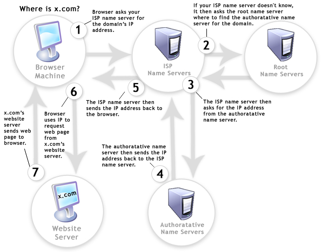
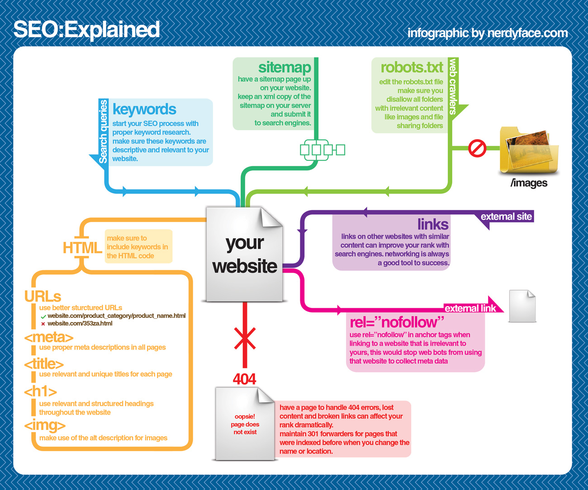
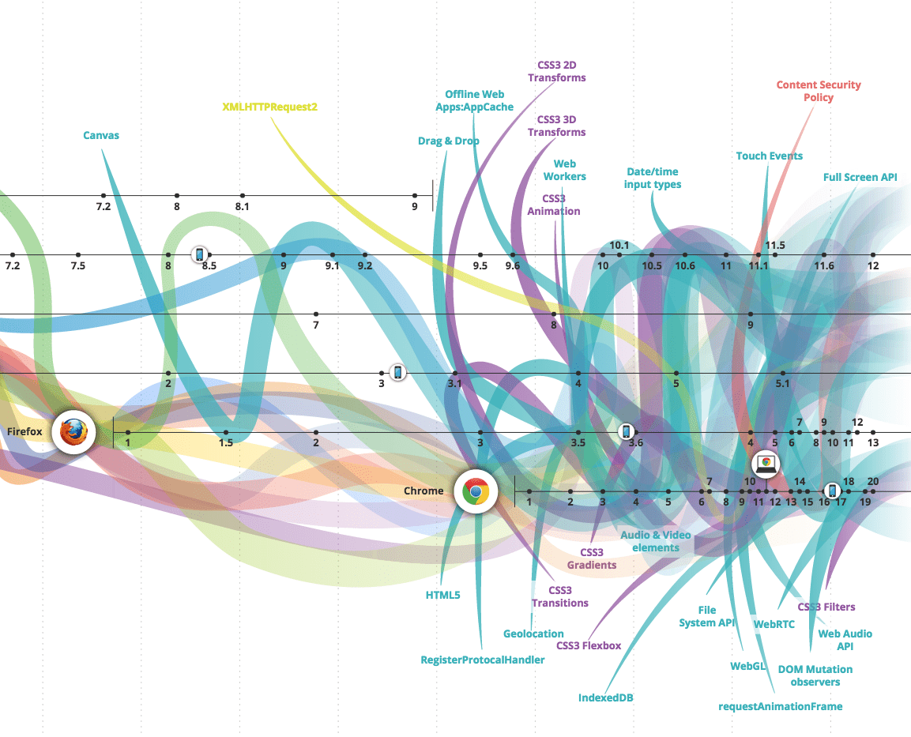
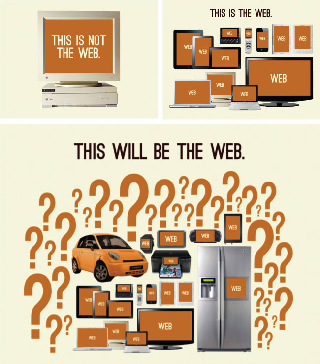

# 第3章-前端开发自学课程推荐

## 3.1 学习互联网 / Web

> 互联网是一个由相互连接的计算机网络组成的全球系统，使用 Internet 协议套件\(TCP/IP\)连接全世界数十亿的设备。它是由数百万个地方到全球范围的私有、公共、学术、商业和政府网络所组成的更大的网络，通过一系列广泛的电子、无线和光学网络技术连接在一起。Internet 承载着海量的信息资源和服务，例如超文本文档链接、万维网应用、电子邮件、电话和用于文件分享的对等网络。
>
> — [Wikipedia](https://en.wikipedia.org/wiki/Internet)

* [什么是互联网?](https://www.youtube.com/watch?v=Dxcc6ycZ73M) \[watch\]
* [互联网基础](http://internetfundamentals.com/) \[watch\]
* [Web 如何运作](https://developer.mozilla.org/en-US/docs/Learn/Getting_started_with_the_web/How_the_Web_works) \[read\]
* 互联网如何运作? [https://developer.mozilla.org/en-US/docs/Learn/Common\_questions/How\_does\_the\_Internet\_work](https://developer.mozilla.org/en-US/docs/Learn/Common_questions/How_does_the_Internet_work) 与 [http://web.stanford.edu/class/msande91si/www-spr04/readings/week1/InternetWhitepaper.htm](http://web.stanford.edu/class/msande91si/www-spr04/readings/week1/InternetWhitepaper.htm) \[read\]
* [互联网如何运作](https://www.khanacademy.org/partner-content/code-org/internet-works) \[watch\]
* [5分钟了解互联网如何运作](https://www.youtube.com/watch?v=7_LPdttKXPc) \[watch\]
* [Web 如何运作](https://www.eventedmind.com/classes/how-the-web-works-7f40254c) \[watch\]
* [什么是互联网? ](http://www.20thingsilearned.com/en-US/what-is-the-internet/1) \[read\]
* [无需畏惧互联网](http://www.dontfeartheinternet.com/)

## 3.2. - 学习浏览器

> Web 浏览器（通常称为浏览器）是用于在万维网上检索，呈现和遍历信息资源的软件应用程序。信息资源由统一资源标识符（URI / URL）标识，并且可以是网页，图像，视频或其他内容。资源中存在的超链接使用户能够轻松地将其浏览器导航到相关资源。虽然浏览器主要用于万维网，但它们也可用于访问私有网络中的 Web 服务器或文件系统中的文件所包含的信息。
>
> — [Wikipedia](https://en.wikipedia.org/wiki/Web_browser)

\*\*\*\*[**最常用的浏览器**](https://netmarketshare.com/?options=%7B%22filter%22%3A%7B%22%24and%22%3A%5B%7B%22deviceType%22%3A%7B%22%24in%22%3A%5B%22Desktop%2Flaptop%22%2C%22Mobile%22%5D%7D%7D%5D%7D%2C%22dateLabel%22%3A%22Trend%22%2C%22attributes%22%3A%22share%22%2C%22group%22%3A%22browser%22%2C%22sort%22%3A%7B%22share%22%3A-1%7D%2C%22id%22%3A%22browsersDesktop%22%2C%22dateInterval%22%3A%22Monthly%22%2C%22dateStart%22%3A%222018-01%22%2C%22dateEnd%22%3A%222018-12%22%2C%22segments%22%3A%22-1000%22%7D)**（客户端与移动端）:**

1. [Chrome](http://www.google.com/chrome/) \(内核: [Blink](https://en.wikipedia.org/wiki/Blink_%28layout_engine%29) + [V8](https://en.wikipedia.org/wiki/V8_%28JavaScript_engine%29)\)
2. [Firefox](https://www.mozilla.org/en-US/firefox/new/) \(内核: [Gecko](https://en.wikipedia.org/wiki/Gecko_%28software%29) + [SpiderMonkey](https://en.wikipedia.org/wiki/SpiderMonkey_%28software%29)\)
3. [Internet Explorer](http://windows.microsoft.com/en-us/internet-explorer/download-ie) \(内核: [Trident](https://en.wikipedia.org/wiki/Trident_%28layout_engine%29) + [Chakra](https://en.wikipedia.org/wiki/Chakra_%28JScript_engine%29)\)
4. [Safari](https://www.apple.com/safari/) \(内核: [Webkit](https://en.wikipedia.org/wiki/WebKit) + [SquirrelFish](https://trac.webkit.org/wiki/SquirrelFish)\)

**浏览器与 Web 技术（即API）的演变**

* \*\*\*\*[evolutionoftheweb.com](http://www.evolutionoftheweb.com/) \[read\]
* [Timeline of web browsers](https://en.wikipedia.org/wiki/Timeline_of_web_browsers) \[read\]

\*\*\*\*[**最常用的无头浏览器**](http://www.asad.pw/HeadlessBrowsers/)**:**

* [无头 Chromium](https://chromium.googlesource.com/chromium/src/+/lkgr/headless/README.md) \(内核: [Blink](https://www.chromium.org/blink) + V8\)
* [SlimerJS](http://slimerjs.org/) \(内核: [Gecko](https://en.wikipedia.org/wiki/Gecko_%28software%29) + [SpiderMonkey](https://en.wikipedia.org/wiki/SpiderMonkey_%28software%29)\)

**浏览器如何运作**

* [20 件我从浏览器与 Web 学到的事情](http://www.20thingsilearned.com/en-US/foreword/1) \[read\]
* [迅捷 CSS: 浏览器如何呈现 Web 页面](http://dbaron.org/talks/2012-03-11-sxsw/master.xhtml) \[read\]
* [浏览器如何运作: 深入现代浏览器](http://www.html5rocks.com/en/tutorials/internals/howbrowserswork/) \[read\]
* [Quantum 来了: 什么是浏览器内核?](https://hacks.mozilla.org/2017/05/quantum-up-close-what-is-a-browser-engine/)
* [浏览器如何渲染页面](https://www.youtube.com/watch?v=SmE4OwHztCc) \[watch\]
* [什么会触发重布局 / 回流](https://gist.github.com/paulirish/5d52fb081b3570c81e3a) \[read\]
* [每个前端开发者都应该知道的页面渲染知识](http://frontendbabel.info/articles/webpage-rendering-101/) \[read\]

**浏览器优化:**

* [浏览器渲染优化](https://www.udacity.com/course/browser-rendering-optimization--ud860) \[watch\]
* [网站性能优化](https://www.udacity.com/course/website-performance-optimization--ud884) \[watch\]

**浏览器对比**

* [Web 浏览器对比](https://en.wikipedia.org/wiki/Comparison_of_web_browsers) \[read\]

**浏览器黑魔法**

* [browserhacks.com](http://browserhacks.com/) \[read\]

**浏览器开发**

过去，前端开发人员在浏览器兼容上花了不少时间，这曾是一门非常重要的学科。今天，抽象（例如，React，Webpack，Post-CSS，Babel 等......）与现代浏览器的结合使浏览器开发变得相当容易。新的挑战不是用户使用什么浏览器，而是他们的浏览器运行在什么设备上。

**常青浏览器**

大部分现代浏览器的最新版本被认为是长青浏览器。也就是说，从理论上讲，它们应该在不提示用户的情况下进行自动更新。这种向自更新浏览器的转变是对淘汰不自动更新的旧浏览器的缓慢反作用。

**浏览器选择**

目前，大多数前端开发人员使用 Chrome 和“Chrome 开发者工具”来开发前端代码。然而，主流的现代浏览器都提供了各自风格的开发工具。可以根据个人喜好选择一个用于开发。更重要的问题是了解你需要支持哪些设备上的哪些浏览器，然后进行适当的测试。

## 3.3 域名系统 \(DNS\)

> 域名系统（DNS）是用于计算机、服务或连接到因特网或专用网络的任何资源的分层分布式命名系统。它将各种信息与分配给每个参与实体的域名相关联。最浅显易见的是，它将人们可以轻易记忆的域名转换为世界各地的计算机服务和设备所需的数字IP地址。域名系统是大多数互联网服务功能的重要组成部分，因为它是互联网的主索引服务。
>
> — [Wikipedia](https://en.wikipedia.org/wiki/Domain_Name_System)

* [DNS 术语、组件与概念简介](https://www.digitalocean.com/community/tutorials/an-introduction-to-dns-terminology-components-and-concepts) \[read\]
* [DNS 说明](https://www.youtube.com/watch?v=72snZctFFtA) \[watch\]
* [DNS 如何运作](https://howdns.works/ep1/) \[read\]
* [互联网: IP 地址与 DNS](https://www.youtube.com/watch?v=5o8CwafCxnU&index=3&list=PLzdnOPI1iJNfMRZm5DDxco3UdsFegvuB7) \[watch\]
* [什么是域名？](https://developer.mozilla.org/en-US/docs/Learn/Common_questions/What_is_a_domain_name) \[read\]

## 3.4 学习 HTTP/网络 \(包括 CORS & WebSockets\)

> **HTTP** - 超文本传输协议\(HTTP\)是一种用于分布式、协作性、超媒体信息系统的应用协议。HTTP是万维网数据通信的基础。
>
> — [Wikipedia](https://en.wikipedia.org/wiki/Hypertext_Transfer_Protocol)

**HTTP 规范**

* [HTTP/2](https://http2.github.io/)
* [超文本传输协议 -- HTTP/1.1](https://tools.ietf.org/html/rfc2616)

**HTTP 文档**

* [MDN HTTP](https://developer.mozilla.org/en-US/docs/Web/HTTP) \[read\]

**HTTP 视频/文章/教程**

* [高性能浏览器网络：每个 Web 开发人员都应该知道的关于网络与 Web 性能的知识](http://chimera.labs.oreilly.com/books/1230000000545/index.html) \[read\]
* [MDN: HTTP 总览](https://developer.mozilla.org/en-US/docs/Web/HTTP/Overview) \[read\]
* [HTTP: 权威指南](https://www.amazon.com/HTTP-Definitive-Guide-Guides/dp/1565925092/ref=cm_cr_arp_d_product_top?&_encoding=UTF8&tag=frontend-handbook-20&linkCode=ur2&linkId=11b990b79d33ddbef63712765715a9c1&camp=1789&creative=9325) \[read\]\[$\]
* [HTTP/2 常见问题](https://http2.github.io/faq/#what-are-the-key-differences-to-http1x) \[read\]
* [HTTP 基础](http://www.pluralsight.com/courses/xhttp-fund) \[watch\]\[$\]
* [HTTP/2 基础](https://app.pluralsight.com/library/courses/http2-fundamentals/table-of-contents) \[watch\]\[$\]
* [HTTP: 每个 Web 开发者必须知道的协议 - 第一部分](http://code.tutsplus.com/tutorials/http-the-protocol-every-web-developer-must-know-part-1--net-31177) \[read\]
* [HTTP: 每个 Web 开发者必须知道的协议 - 第二部分](http://code.tutsplus.com/tutorials/http-the-protocol-every-web-developer-must-know-part-2--net-31155) \[read\]
* [HTTP 简要概述](http://code.tutsplus.com/series/http-succinctly--net-33683) \[read\]

**HTTP 状态码**

* [HTTP 状态码](https://httpstatuses.com/)
* [60秒学会 HTTP 状态码](http://webdesign.tutsplus.com/tutorials/http-status-codes-in-60-seconds--cms-24317) \[watch\]

> **CORS** - 跨源资源共享\(CORS\)是一种机制，它允许 Web 页面访问来自不同源服务器上的指定的资源\(例如字体\)。
>
> — [Wikipedia](https://en.wikipedia.org/wiki/Cross-origin_resource_sharing)

**CORS 规范**

* [跨源资源共享](https://www.w3.org/TR/cors/)

**CORS**

* [CORS 行动](https://www.amazon.com/CORS-Action-Creating-consuming-cross-origin/dp/161729182X/?&_encoding=UTF8&tag=frontend-handbook-20&linkCode=ur2&linkId=47ebd885d688a4ed69f77a1bd8273f8a&camp=1789&creative=9325) \[read\]\[$\]
* [HTTP 访问控制 \(CORS\)](https://developer.mozilla.org/en-US/docs/Web/HTTP/Access_control_CORS) \[read\]

> **WebSockets** - WebSocket 是通过一个 TCP 连接提供全双工通信通道的协议。IETF 在 2011 年将 WebSocket 协议标准化为RFC 6455，而 Web IDL 中的 WebSocket API 正在被 W3C 标准化。
>
> — [Wikipedia](https://en.wikipedia.org/wiki/WebSocket)

**WebSockets**

* [通过 WebSockets 连接网络](https://code.tutsplus.com/courses/connect-the-web-with-websockets) \[watch\]
* [WebSocket: 轻量级客户端 - 服务器通信协议](https://www.amazon.com/WebSocket-Client-Server-Communications-Andrew-Lombardi/dp/1449369278/?&_encoding=UTF8&tag=frontend-handbook-20&linkCode=ur2&linkId=dd39395cf3d2ab4fc7c820d7c19db39a&camp=1789&creative=9325) \[read\]\[$\]
* [WebSocket 协议](https://tools.ietf.org/html/rfc6455) \[read\]

## 3.5 学习网络托管

> 网络托管服务是一种允许个人和组织通过万维网访问其网站的互联网托管服务，Web 托管商是指在客户自有/租用的服务器上提供空间以及提供 Internet 连接（通常在数据中心中）的公司。

> — [Wikipedia](https://en.wikipedia.org/wiki/Web_hosting_service)

**综合学习:**

* [网络托管 101: 立即让你的网站与 Web 连接](https://www.udemy.com/web-hosting-101/) \[video\]

## 3.6 学习通用前端开发

* [前端训练营 / 互联网上的日子](https://github.com/Microsoft/frontend-bootcamp) \[read\]
* [为 Web 开发生涯提前做好准备](https://frontendmasters.com/learn/beginner/)
* [成为一名前端开发者](https://www.lynda.com/learning-paths/Web/become-a-front-end-web-developer) \[watch\]\[$\]
* [成为一名 Web 开发者](http://www.yellowshoe.com.au/standards) \[read\]
* [freeCodeCamp](http://freecodecamp.com/) \[interact\]
  * [通过 \#100DaysOfCode 学习前端开发\[read\]](https://github.com/nas5w/100-days-of-code-frontend#contibuting)
* [前端开发者纳米学位](https://www.udacity.com/course/front-end-web-developer-nanodegree--nd001) \[watch\]\[$\]
* [前端开发生涯起步](http://www.pluralsight.com/courses/front-end-web-development-career-kickstart) \[watch\]\[$\]
* [前端 Web 开发: 入门](http://www.pluralsight.com/courses/front-end-web-development-get-started) \[watch\]\[$\]
* [前端 Web 开发快速入门（HTML5、CSS、JavaScript）](http://www.pluralsight.com/courses/front-end-web-app-html5-javascript-css) \[watch\]\[$\]
* [Web 开发权威指南](https://www.amazon.com/Front-End-Web-Development-Ranch-Guide/dp/0134433947/?&_encoding=UTF8&tag=frontend-handbook-20&linkCode=ur2&linkId=06802d4e42ca55b03294779c960d0826&camp=1789&creative=9325) \[read\]\[$\]
* [全面介绍 Web 开发](https://frontendmasters.com/courses/web-development-v2/)\[watch\]\[$\]
* [学习前端 Web 开发](https://teamtreehouse.com/tracks/front-end-web-development) \[watch\]\[$\]
* [所以，你希望成为一名前端开发工程师？](https://www.youtube.com/watch?v=Lsg84NtJbmI) \[watch\]
* [codecademy.com: Web 开发路线](https://www.codecademy.com/learn/paths/web-development) \[interact\]\[free to $\]
* [web.dev](https://web.dev/learn) \[read\]

## 3.7 学习用户界面/交互设计

> **用户界面设计** - 用户界面设计\(UI\)或用户界面工程是为计算机、家用电器、移动设备和其他电子设备等机器和软件设计用户界面，以最大限度地提高用户体验作为核心。用户界面设计的目标是在实现用户目标\(以用户为中心的设计\)方面，使用户的交互尽可能的简单和高效。
>
> — [Wikipedia](https://en.wikipedia.org/wiki/User_interface_design)
>
> **交互设计模式** - 设计模式是记录常见设计问题解决方案的常用方式。这个概念是由建筑师克里斯托弗·亚历山大\(Christopher Alexander\)引入的，用于城市规划和建筑建筑学，并被应用于各种其他学科，包括教育学、开发组织和过程，以及软件架构与设计。
>
> — [Wikipedia](https://en.wikipedia.org/wiki/Design_pattern)
>
> **用户体验设计** - 用户体验设计\(UXD或UED或XD\)是通过提高用户与产品交互时，产品所提供的可用性、可访问性与乐趣来提高用户满意度的过程。用户体验设计包括传统的人机交互\(HCI\)设计，并通过满足用户感知的产品或服务的方方面面对其进行延伸。
>
> — [Wikipedia](https://en.wikipedia.org/wiki/User_experience_design)
>
> **人机交互** - 人机交互\(HCI\)研究计算机技术的设计和应用，专注于人\(用户\)与计算机之间的接口。HCI 领域的研究人员既观察了人与计算机交互的方式，也研究了让人类与计算机以全新方式交互的设计技术。
>
> — [Wikipedia](https://en.wikipedia.org/wiki/Human%E2%80%93computer_interaction)

我建议至少阅读以下与此问题相关的权威文档，以便维护或构建可用的用户界面。

* [About Face: 交互设计入门](https://www.amazon.com/About-Face-Essentials-Interaction-Design-ebook/dp/B00MFPZ9UY/?&_encoding=UTF8&tag=frontend-handbook-20&linkCode=ur2&linkId=c723c84ad4d246cb7f1c4a737c5f38a4&camp=1789&creative=9325) \[read\]\[$\]
* [Design for Hackers: Reverse Engineering Beauty](https://www.amazon.com/Design-Hackers-Reverse-Engineering-Beauty/dp/1119998956/?&_encoding=UTF8&tag=frontend-handbook-20&linkCode=ur2&linkId=2a52f0968de21c03f069d857b9d92b37&camp=1789&creative=9325) \[read\]\[$\]
* [为非设计师准备的设计课](https://www.youtube.com/watch?v=ZbrzdMaumNk&feature=youtu.be) \[watch\]
* [界面设计模式](https://book.douban.com/subject/25716088/) \[read\]\[$\]
* [设计 Web 界面：丰富交互的原则与模式](https://www.amazon.com/Designing-Web-Interfaces-Principles-Interactions-ebook/dp/B0026OR33U/?&_encoding=UTF8&tag=frontend-handbook-20&linkCode=ur2&linkId=03fb59f4a4345732fae9ecdfaa5076ae&camp=1789&creative=9325) \[read\]\[$\]
* [点石成金：访客至上的网页设计秘笈](https://www.amazon.com/Dont-Make-Think-Revisited-Usability/dp/0321965515/?&_encoding=UTF8&tag=frontend-handbook-20&linkCode=ur2&linkId=8b0b0771a9985e4e030ef1fe29cf6409&camp=1789&creative=9325) \[read\]\[$\]

## 3.8 学习 HTML / CSS

> **HTML** - 超文本标记语言（通常被称为HTML）是用于创建 web 页面的标准标记语言。Web 浏览器可以读取HTML文件，并将其渲染成可视化网页。HTML 从语义上描述了网站的结构随着线索的呈现，使其成为一种标记语言，而不是编程语言。
>
> — [Wikipedia](https://en.wikipedia.org/wiki/HTML)
>
> **CSS** - 层叠样式表（CSS）是一种样式表语言，用于描述用标记语言编写的文档的外观和格式。虽然它经常被用来更改用 HTML 和 XHTML 编写的网页和用户界面的样式，该语言还是能应用于任何类型的 XML 文档，包括纯 XML、SVG 和 XUL。与 HTML 和 JavaScript 一样，CSS 也是大多数网站用来创建具有视觉吸引力的网页、web应用交互界面以及许多移动端用户界面的基础技术。
>
> — [Wikipedia](https://en.wikipedia.org/wiki/Cascading_Style_Sheets)

就像建造一座房子一样，如果将 HTML 类比为框架的话，CSS 就是绘画和装饰。

**综合学习:**

* [利用 CSS 绝对定位至中心](http://codepen.io/shshaw/full/gEiDt) \[read\]
* [CSS 定位](http://www.pluralsight.com/courses/css-positioning-1834) \[watch\]\[$\]
* [Web 开发介绍（v2）](https://frontendmasters.com/courses/web-development-v2/) \[watch\]\[$\]
* [前端开发入门](http://www.pluralsight.com/courses/front-end-web-development-get-started) \[watch\]\[$\]
* [前端开发快速入门（ HTML](http://www.pluralsight.com/courses/front-end-web-app-html5-javascript-css)[、CSS、JavaScript）](http://www.pluralsight.com/courses/front-end-web-app-html5-javascript-css) \[watch\]\[$\]
* [HTML 与 CSS: 设计与构建网站](https://www.amazon.com/gp/product/1118008189/?&_encoding=UTF8&tag=frontend-handbook-20&linkCode=ur2&linkId=b1c45ab715f267f7dfed8c981c14eceb&camp=1789&creative=9325) \[read\]\[$\]
* [HTML 文档流](http://www.pluralsight.com/courses/html-document-flow-1837) \[watch\]\[$\]
* [精通 HTML: 语义、规范与样式](https://www.amazon.com/gp/product/1590597656/?&_encoding=UTF8&tag=frontend-handbook-20&linkCode=ur2&linkId=a5c4eb997239ea9e57a86456cef7763c&camp=1789&creative=9325) \[read\]\[$\]
* [互联网很难](https://internetingishard.com/) \[read\]
* [HTML/CSS 入门: 制作网页](https://www.khanacademy.org/computing/computer-programming/html-css) \[watch\]
* [学习编写 HTML / CSS](http://learn.shayhowe.com/html-css/) \[read\]
* [学习 CSS 布局](http://learnlayout.com/) \[read\]
* [MarkSheet](http://marksheet.io/) \[read\]
* [MDN: HTML](https://developer.mozilla.org/en-US/docs/Learn/HTML) \[read\]
* [MDN: CSS](https://developer.mozilla.org/en-US/docs/Learn/CSS) \[read\]
* [语义化 HTML: 如何构造页面](https://webdesign.tutsplus.com/courses/semantic-html-how-to-structure-web-pages) \[watch\]
* [纯粹的 HTML 表单结构](https://webdesign.tutsplus.com/courses/solid-html-form-structure) \[watch\]
* [理解 CSS 盒子模型](https://webdesign.tutsplus.com/courses/understanding-the-css-box-model) \[watch\]
* [弹性 Web 设计](https://resilientwebdesign.com/) \[read\]

**精通 CSS:**

* [Flexbox 全面指南](https://css-tricks.com/snippets/css/a-guide-to-flexbox/) \[read\]
* [面向响应式网页设计的 Grid 和 Flexbox](https://frontendmasters.com/courses/css-grids-flexbox/) \[watch\]\[$\]
* [CSS 晚餐](http://flukeout.github.io/) \[interact\]
* [CSS 选择器（从 CSS1 至 CSS4）](http://css4-selectors.com/selectors/) \[read\]
* [CSS 揭秘](https://www.amazon.com/CSS-Secrets-Solutions-Everyday-Problems/dp/1449372635/?&_encoding=UTF8&tag=frontend-handbook-20&linkCode=ur2&linkId=40a9480c18839b4b2ea798aa2afafd0e&camp=1789&creative=9325) \[read\]\[$\]
* [CSS3](https://developer.mozilla.org/en-US/docs/Web/CSS/CSS3) \[read\]
* [深入 CSS （第二版）](https://frontendmasters.com/courses/css-in-depth-v2/) \[watch\]\[$\]
* [什么是 Flexbox?! 一个简单的，包含 20 节课的免费视频课程助你精通 CSS Flexbox](http://flexbox.io/) \[watch\]
* [30 秒 CSS - 一个你可以在 30 秒内理解的实用 CSS 集合](https://atomiks.github.io/30-seconds-of-css/) \[read\]

**参考文献/文档:**

* [CSS Triggers...关于布局、渲染与构建的游戏](http://csstriggers.com/)
* [cssreference.io](http://cssreference.io/)
* [cssvalues.com](http://cssvalues.com/)
* [Chrome 浏览器的默认 CSS](https://chromium.googlesource.com/chromium/blink/+/master/Source/core/css/html.css)
* [Head - A list of everything that could go in the of your document](http://gethead.info/)
* [HTML 属性参考](https://developer.mozilla.org/en-US/docs/Web/HTML/Attributes)
* [MDN CSS 参考](https://developer.mozilla.org/en-US/docs/Web/CSS/Reference)
* [MDN HTML 元素参考](https://developer.mozilla.org/en-US/docs/Web/HTML/Element)

**术语表/词典:**

* [CSS 术语集 - CSS 编程参考，包括注释、属性与选择器](https://www.codecademy.com/articles/glossary-css)
* [CSS 词典](http://apps.workflower.fi/vocabs/css/en)
* [HTML 元素术语集参考](https://www.codecademy.com/articles/glossary-html)

**标准/规范:**

* [所有 W3C CSS 规范](http://www.w3.org/Style/CSS/current-work#roadmap)
* [所有 W3C HTML 规范](http://www.w3.org/standards/techs/html#w3c_all)
* [层叠样式表 2 级修订版 2（CSS 2.2）规范](https://drafts.csswg.org/css2/)
* [CSS 索引 - CSS 规范定义的每个术语的列表](https://drafts.csswg.org/indexes/)
* [HTML 元素（现有规范）](https://html.spec.whatwg.org/multipage/semantics.html#semantics)
* [全局属性](https://developer.mozilla.org/en-US/docs/Web/HTML/Global_attributes)
* [HTML 语法（现有规范）](https://html.spec.whatwg.org/multipage/syntax.html#syntax)
* [W3C HTML 5.2](http://w3c.github.io/html/)
* [3 级选择器](http://www.w3.org/TR/css3-selectors/)

**CSS 架构:**

* [原子设计](http://atomicdesign.bradfrost.com/) \[read\]
* [BEM](http://getbem.com/introduction/)
* [ITCSS](https://www.xfive.co/blog/itcss-scalable-maintainable-css-architecture/)
* [OOCSS](http://oocss.org/) \[read\]
* [SMACSS](https://smacss.com/) \[read\]\[$\]
  * [Scalable Modular Architecture for CSS \(SMACSS\)](https://frontendmasters.com/courses/smacss/) \[watch\]\[$\]
* [SUIT CSS](http://suitcss.github.io/)
* [rscss](http://rscss.io/)

**编辑/架构公约:**

* [CSS 代码指南](http://codeguide.co/#css) \[read\]
* [css 架构](https://github.com/jareware/css-architecture)
* [cssguidelin.es](http://cssguidelin.es/) \[read\]
* [Idiomatic CSS](https://github.com/necolas/idiomatic-css) \[read\]
* [可维护CSS](http://maintainablecss.com/) \[read\]
* [开发灵活、持久和可持续的 HTML 与 CSS 的标准](http://mdo.github.io/code-guide/) \[read\]

## **3.9 学习搜索引擎优化**

> 搜索引擎优化（SEO）是提升网站或网页在搜索引擎的未付费结果中的可见性的过程，通常被称为“自然的”、“有机的”或“赚来的”结果。一般来说，一个站点出现在搜索结果列表中越早\(或在搜索结果页面上排名越靠前\)，出现频率越高，它从搜索引擎用户那里获得的访问者就越多。SEO 可以针对不同类型的搜索，包括图像搜索、地方搜索、视频搜索、学术搜索、新闻搜索和特定行业的垂直搜索引擎。
>
> — [Wikipedia](https://en.wikipedia.org/wiki/Search_engine_optimization)

**综合学习:**

* [Google 搜索引擎优化入门指南](http://static.googleusercontent.com/media/www.google.com/en//webmasters/docs/search-engine-optimization-starter-guide.pdf) \[read\]
* [现代 SEO](https://frontendmasters.com/courses/modern-seo/) \[watch\]\[$\]
* [SEO 基础（](http://www.lynda.com/Analytics-tutorials/SEO-Fundamentals/187858-2.html)[David Boo](http://www.lynda.com/Analytics-tutorials/SEO-Fundamentals/187858-2.html)[h）](http://www.lynda.com/Analytics-tutorials/SEO-Fundamentals/187858-2.html)\[watch\]\[$\]
* [SEO 基础（Paul Wilson）](http://www.pluralsight.com/courses/seo-fundamentals) \[watch\]\[$\]
* [SEO 入门教程（2016）](http://www.hobo-web.co.uk/seo-tutorial/) \[read\]
* [面向网页设计师的 SEO](https://webdesign.tutsplus.com/courses/seo-for-web-designers) \[watch\]\[$\]

## 3.10 学习 JavaScript

> JavaScript 是一种高级、动态、无类型的解释型编程语言，已经经由 ECMAScript 语言规范实现了标准化。是除了 HTML 和 CSS 外万维网内容生产的三大基本技术之一；主流网站都使用它，且所有现代 Web 浏览器都对其提供了原生支持。JavaScript 是基于原型，以函数为第一公民的语言，这使得它有多种编程范式，支持面向对象、命令式与函数式编程风格。它有一个用于处理文本、数组、日期和正则表达式的 API，但不包括任何 I/O，如网络，存储以及图像处理功能，这些都依赖于它所嵌入的环境。

> — [Wikipedia](https://en.wikipedia.org/wiki/JavaScript)

**入门学习:**

* [MDN: JavaScript](https://developer.mozilla.org/en-US/docs/Learn/JavaScript) \[read\]
* [javascript.info](http://javascript.info/)
* [JavaScript 启蒙](http://www.javascriptenlightenment.com/) \[read\]
* [JavaScript 编程精解](http://eloquentjavascript.net/) \[read\]

**综合学习:**

* [用 JavaScript交谈](http://speakingjs.com/es5/index.html) \[read\]
* [面向急性子程序员的 JavaScript](http://exploringjs.com/impatient-js/index.html) \[read\]
* [你不知道的 JavaScript: 提升](https://github.com/getify/You-Dont-Know-JS/blob/master/up%20&%20going/README.md#you-dont-know-js-up--going) \[read\]
* [你不知道的 JavaScript: 类型 & 语法](https://github.com/getify/You-Dont-Know-JS/blob/master/types%20&%20grammar/README.md#you-dont-know-js-types--grammar) \[read\]
* [你不知道的 JavaScript: 作用域 & 闭包](https://github.com/getify/You-Dont-Know-JS/blob/master/scope%20&%20closures/README.md#you-dont-know-js-scope--closures) \[read\]
* [你不知道的 JavaScript: this & 对象原型](https://github.com/getify/You-Dont-Know-JS/blob/master/this%20&%20object%20prototypes/README.md#you-dont-know-js-this--object-prototypes) \[read\]
* [现代 JavaScript 备忘录 - 在现代项目中您经常遇到的 JavaScript 知识点备忘录](https://github.com/mbeaudru/modern-js-cheatsheet) \[read\]
* [JavaScript 难点](https://frontendmasters.com/courses/javascript-hard-parts/) \[watch\]\[$\]
* [深入 JavaScript 基础 \(第三版\)](https://frontendmasters.com/courses/deep-javascript-v3/) \[watch\]\[$\]

**精通:**

* [设置 ES6](https://leanpub.com/setting-up-es6) \[read\]
* [每个人都能懂的 ES6!](https://es6.io/) \[watch\]\[$\]
* [探索 ES6](http://exploringjs.com/es6.html) \[read\]
* [你不知道的 JavaScript: ES6 & ](https://github.com/getify/You-Dont-Know-JS/blob/master/es6%20&%20beyond/README.md#you-dont-know-js-es6--beyond)现在与未来 \[read\]
* [深入了解 ES6](https://www.amazon.com/Understanding-ECMAScript-Definitive-JavaScript-Developers/dp/1593277571/ref=as_li_ss_tl?&_encoding=UTF8&tag=fronenddevejo-20&linkCode=ur2&linkId=1ca4f5f23b42aeadad0990ab3bf91ca7&camp=1789&creative=9325) \[read\]\[$\]
* [JavaScript: 最新部分](https://frontendmasters.com/courses/js-recent-parts/) \[watch\]\[$\]
* [探索 ES2016 与 ES2017](http://exploringjs.com/es2016-es2017/index.html) \[read\]
* [探索 ES2018 与 ES2019](http://exploringjs.com/es2018-es2019/index.html) \[read\]
* [JavaScript 正则表达式启蒙](http://codylindley.com/techpro/2013_05_14__javascript-regular-expression-/) \[read\]
* [运用正则表达式](http://www.lynda.com/Regular-Expressions-tutorials/Using-Regular-Expressions/85870-2.html) \[watch\]\[$\]
* [你不知道的 JavaScript: 异步 & 性能](https://github.com/getify/You-Dont-Know-JS/blob/master/async%20&%20performance/README.md#you-dont-know-js-async--performance) \[read\]
* [JavaScript with Promises](http://www.amazon.com/JavaScript-Promises-Daniel-Parker/dp/1449373216/ref=pd_sim_sbs_14_5) \[read\]\[$\]
* [测试驱动的 JavaScript 开发](http://www.amazon.com/dp/0321683919/) \[read\]\[$\]
* [JS 终结者](https://mythbusters.js.org/index.html) \[read\]
* [健壮的 JavaScript](https://molily.de/robust-javascript/) \[read\]
* [JavaScript 算法与数据结构](https://github.com/trekhleb/javascript-algorithms#readme) \[read\]
* [33 个所有 JavaScript 开发者都需要知道的概念](https://github.com/leonardomso/33-js-concepts) \[read\]
* [doesitmutate.xyz](https://doesitmutate.xyz/) \[read\]

**JavaScript 函数式编程:**

* [函数式编程术语](https://github.com/hemanth/functional-programming-jargon#functional-programming-jargon)
* [funfunfunction: JavaScript 函数式编程](https://www.youtube.com/watch?v=BMUiFMZr7vk&list=PL0zVEGEvSaeEd9hlmCXrk5yUyqUag-n84) \[watch\]
* [Functional-Light-JS](https://github.com/getify/Functional-Light-JS) \[read\]
* [JavaScript 函数式编程: 如何运用函数式编程技巧提升你的 JavaScript 程序？](https://www.amazon.com/Functional-Programming-JavaScript-functional-techniques/dp/1617292826/ref=sr_1_1?&_encoding=UTF8&tag=fronenddevejo-20&linkCode=ur2&linkId=dcc6b0cb7de57fa841f1b178d2d54b9d&camp=1789&creative=9325) \[read\]
* [FP 指南（javascript）](https://drboolean.gitbooks.io/mostly-adequate-guide/content/)\[read\]
* [Frisby 教授介绍可组合函数式 JavaScript](https://egghead.io/courses/professor-frisby-introduces-composable-functional-javascript) \[watch\]
* [JavaScript Allongé](https://leanpub.com/javascriptallongesix) \[read\]\[$\]
* [Functional-Lite JavaScript \(第二版\)](https://frontendmasters.com/courses/functional-javascript-v2/) \[watch\]\[$\]
* [JavaScript 的核心函数式编程](https://frontendmasters.com/courses/functional-javascript/) \[watch\]\[$\]

**参考文献/文档:**

* [MDN JavaScript 参考文档](https://developer.mozilla.org/en-US/docs/Web/JavaScript/Reference)
* [MSDN JavaScript 参考文档](https://msdn.microsoft.com/en-us/library/yek4tbz0.aspx)

**术语表/百科全书/术语:**

* \*\*\*\*[JavaScript 百科全书](http://www.crockford.com/javascript/encyclopedia/)
* [JavaScript 术语表](https://www.codecademy.com/articles/glossary-javascript)
* [JavaScript 术语（简略版）](http://jargon.js.org/)

**标准/规范:**

* [如何阅读 ECMAScript 规范](https://timothygu.me/es-howto/)
* [ECMAScript® 2015 语言规范](http://www.ecma-international.org/ecma-262/6.0/index.html)
* [ECMAScript® 2016 语言规范](https://www.ecma-international.org/ecma-262/7.0/index.html)
* [ECMAScript® 2017 语言规范](http://www.ecma-international.org/ecma-262/8.0/index.html)
* [ECMAScript® 2018 语言规范](http://www.ecma-international.org/ecma-262/9.0/index.html)
* [ECMAScript® 2019 语言规范](https://tc39.github.io/ecma262/)
* [ECMA262 状态、进展与文档](https://github.com/tc39/ecma262)

**编码规范:**

* [Airbnb JavaScript 编码规范](http://airbnb.io/javascript/)
* [JavaScript 标准编码规范](http://standardjs.com/rules.html)
* [JavaScript 分号编码规范](https://github.com/Flet/semistandard)

**不推荐的 JS 学习资源:**

* [Crockford on JavaScript - Volume 1: The Early Years](https://www.youtube.com/watch?v=JxAXlJEmNMg) \[watch\]
* [Crockford on JavaScript - Chapter 2: And Then There Was JavaScript](https://www.youtube.com/watch?v=RO1Wnu-xKoY) \[watch\]
* [Crockford on JavaScript - Act III: Function the Ultimate](https://www.youtube.com/watch?v=ya4UHuXNygM) \[watch\]
* [Crockford on JavaScript - Episode IV: The Metamorphosis of Ajax](https://www.youtube.com/watch?v=Fv9qT9joc0M) \[watch\]
* [Crockford on JavaScript - Part 5: The End of All Things](https://www.youtube.com/watch?v=47Ceot8yqeI) \[watch\]
* [Crockford on JavaScript - Scene 6: Loopage](https://www.youtube.com/watch?v=QgwSUtYSUqA) \[watch\]
* [JavaScript 模式](http://www.amazon.com/gp/product/0596806752/ref=as_li_tl?ie=UTF8&camp=1789&creative=390957&creativeASIN=0596806752&linkCode=as2&tag=fronenddevejo-20&linkId=K56OPQZNQNMPF6QI) \[read\]\[$\]
* [JavaScript 面向对象精要](http://www.amazon.com/gp/product/1593275404/ref=as_li_tl?ie=UTF8&camp=1789&creative=390957&creativeASIN=1593275404&linkCode=as2&tag=fronenddevejo-20&linkId=NQTZVDOIMJRGMAQM) \[read\]\[$\]
* [JavaScript 模块](http://jsmodules.io/cjs.html) \[read\]
* [JavaScript 函数式编程](http://www.amazon.com/gp/product/1449360726/ref=as_li_tl?ie=UTF8&camp=1789&creative=390957&creativeASIN=1449360726&linkCode=as2&tag=fronenddevejo-20&linkId=BDQC3FTEB3YXTYCK) \[read\]\[$\]
* [JavaScript 和 Web 的优点](https://frontendmasters.com/courses/good-parts-javascript-web/) \[watch\]\[$\]
* [高性能 JavaScript](http://www.amazon.com/Performance-JavaScript-Faster-Application-Interfaces/dp/059680279X/ref=sr_1_1) \[read\]\[$\]

**JS 探索/可视化呈现:**

* [JavaScript 数组探索](https://sdras.github.io/array-explorer/)
* [JavaScript 对象探索](https://sdras.github.io/object-explorer/)
* [JavaScript 可视化呈现](https://tylermcginnis.com/javascript-visualizer/)

## 3.11 学习 DOM, BOM, CSSOM 与 jQuery

> **DOM** - 文档对象模型（DOM）是一种跨平台的、独立于语言的约定，用于表示与操作 HTML、XHTML 和 XML 文档中的对象。每个文档的节点都按树状结构进行组织，称为 DOM 树。可以使用对象上的方法对 DOM 树中的对象进行寻址和操作，DOM 的公共接口在其应用程序编程接口（API）中被指定。
>
> — [Wikipedia](https://en.wikipedia.org/wiki/Document_Object_Model)

> **BOM** - 浏览器对象模型\(Browser Object Model, BOM\)是一个浏览器独有的约定，指浏览器暴露的所有对象组成的表示模型。与文档对象模型不同，其既没有标准的实现，也没有严格的定义，所以浏览器厂商可以自由地实现BOM。
>
> — [Wikipedia](https://en.wikipedia.org/wiki/Browser_Object_Model)
>
> **jQuery** - jQuery 是一个跨平台的 JavaScript 库，旨在简化 HTML 的客户端脚本。jQuery 是当前最受欢迎的 JavaScript 库，全球前10,000个访问最高的网站中，有 65% 使用了 jQuery。jQuery 是基于 MIT 协议授权的免费、开源软件。
>
> — [Wikipedia](https://en.wikipedia.org/wiki/JQuery)

理想的学习路径\(当然也是最困难的学习路径\)是先学习 JavaScript，再学习 DOM，最后学习 jQuery。然而，学习路径应该根据您的个人情况进行规划。大多数前端开发人员会先学习JavaScript，然后通过学习 jQuery 来学习DOM。无论您选择哪条路径，都要确保理解 JavaScript、DOM 和 jQuery 的底层原理。

**综合学习:**

* [文档对象模型](http://eloquentjavascript.net/13_dom.html) \[read\]
* [HTML/JS: 让网页变得可互动](https://www.khanacademy.org/computing/computer-programming/html-css-js) \[watch\]
* [HTML/JS: 运用 jQuery 让网页变得可互动](https://www.khanacademy.org/computing/computer-programming/html-js-jquery) \[watch\]
* [jQuery 启蒙](http://jqueryenlightenment.com/) \[read\]
* [什么是 DOM?](https://developer.mozilla.org/en-US/docs/Web/API/Document_Object_Model/Introduction) \[read\]

**精通:**

* [JavaScript ](http://www.amazon.com/gp/product/1590598563/ref=as_li_tl?ie=UTF8&camp=1789&creative=390957&creativeASIN=1590598563&linkCode=as2&tag=fronenddevejo-20&linkId=VQZU5EQIQQXCF56Y)[DOM 高级程序设计](http://www.amazon.com/gp/product/1590598563/ref=as_li_tl?ie=UTF8&camp=1789&creative=390957&creativeASIN=1590598563&linkCode=as2&tag=fronenddevejo-20&linkId=VQZU5EQIQQXCF56Y) \[read\]\[$\]
* [JS 基础进阶 -- jQuery & 纯 DOM 编程](https://frontendmasters.com/courses/javascript-jquery-dom/) \[watch\]\[$\]
* [Douglas Crockford: 不方便的 API - DOM 理论](https://www.youtube.com/watch?v=Y2Y0U-2qJMs&list=PL5586336C26BDB324&index=2) \[watch\]
* [DOM 启蒙](http://www.amazon.com/DOM-Enlightenment-Cody-Lindley/dp/1449342841/) \[read\]\[$\][（在线版本）](http://domenlightenment.com/)
* [修复常见 jQuery Bugs](http://www.pluralsight.com/courses/fixing-common-jquery-bugs) \[watch\]\[$\]
* [jQuery-Free JavaScript](http://www.pluralsight.com/courses/jquery-free-javascript) \[watch\]\[$\]
* [jQuery 技巧](http://www.pluralsight.com/courses/jquery-tips-and-tricks) \[watch\]\[$\]

**参考文献/文档:**

* [jQuery 文档](http://api.jquery.com/)
* [事件](https://html.spec.whatwg.org/#events-2)
* [DOM 浏览器支持](http://www.webbrowsercompatibility.com/dom/desktop/)
* [DOM 事件浏览器支持](http://www.webbrowsercompatibility.com/dom-events/desktop/)
* [HTML 接口浏览器支持](http://www.webbrowsercompatibility.com/html-interfaces/desktop/)
* [MDN 文档对象模型 \(DOM\)](https://developer.mozilla.org/en-US/docs/Web/API/Document_Object_Model)
* [MDN 浏览器对象模型](https://developer.mozilla.org/en-US/docs/Web/API/Window)
* [MDN 事件参考](https://developer.mozilla.org/en-US/docs/Web/Events)
* [MSDN 文档对象模型 \(DOM\)](https://msdn.microsoft.com/en-us/library/hh772384%28v=vs.85%29.aspx)
* [CSS 对象模型 \(CSSOM\)](https://developer.mozilla.org/en-US/docs/Web/API/CSS_Object_Model)

**Standards/Specifications:**

* [文档对象模型 \(DOM\) 3 级事件规范](https://www.w3.org/TR/DOM-Level-3-Events/)
* [文档对象模型 \(DOM\) 技术报告](http://www.w3.org/DOM/DOMTR)
* [DOM 现有标准](https://dom.spec.whatwg.org/)
* [W3C DOM4](https://www.w3.org/TR/2015/REC-dom-20151119/)

## 3.12 学习 Web 动画

**综合学习:**

* [SVG 与动画入门（第二版）](https://frontendmasters.com/courses/svg-essentials-animation/) \[$\]\[watch\]
* [Web 动画进阶](https://www.codeschool.com/courses/adventures-in-web-animations) \[$\]\[watch\]
* [动画与 Snap.svg](https://webdesign.tutsplus.com/courses/animating-with-snapsvg) \[$\]\[watch\]
* [CSS3 与 HTML5 动画](https://frontendmasters.com/courses/animation-storytelling-html5-css3/) \[$\]\[watch\]
* [用 CSS 生成动画](http://www.kirupa.com/css_animations/index.htm) \[read & watch\]
* [现实世界中的 CSS 动画](https://webdesign.tutsplus.com/courses/css-animation-in-the-real-world) \[$\]\[watch\]
* [JavaScript + HTML5 动画基础](http://www.amazon.com/Foundation-HTML5-Animation-JavaScript-Lamberta/dp/1430236655/ref=sr_1_3) \[$\]\[read\]
* [学习用 JavaScript 去创建动画](http://www.kirupa.com/javascript_animations/index.htm) \[read & watch\]
* [CSS 动效设计](https://frontendmasters.com/courses/motion-design-css/) \[$\]\[watch\]
* [2015 动画状态](https://air.mozilla.org/rachel-nabors-state-of-the-animation-2015/) \[watch\]
* [Web Animation using JavaScript: Develop & Design \(Develop and Design\)](http://www.amazon.com/Web-Animation-using-JavaScript-Develop-ebook/dp/B00UNKXVDU/ref=sr_1_1) \[$\]\[read\]

**标准/规范:**

* [Web 动画](https://w3c.github.io/web-animations/)

## 3.13 学习 Web 字体、图标与图片

> 网络排版是指在万维网上使用字体。在 HTML 刚刚被创造时，字体和样式完全由每个 Web浏览器的设置所控制。在 Netscape 于 1995 年引入标记之前，还没有任何单独的Web页面控制字体显示的机制，该标记随后被标准化为 HTML 3.2 规范。但是，由标签指定的字体或回退字体必须安装在用户的计算机上，比如浏览器的默认 sans-serif 或 monospace 字体。第一个层叠样式表规范于 1996 年发布，提供了相同的功能。
>
> CSS2 规范于 1998 年发布，试图通过添加字体匹配、合成和下载来改进字体选择过程。这些技术没有得到太多的应用，并在 CSS2.1 规范中被删除了。然而，Internet Explorer 在 1997 年发布的 4.0 版本中增加了对字体下载功能的支持。字体下载后来包含在 CSS3 字体模块中，并在 Safari 3.1、Opera 10 和 Mozilla Firefox 3.5 中得到实现。这随后增加了人们对 Web 排版和字体下载的兴趣。
>
> — [Wikipedia](https://en.wikipedia.org/wiki/Web_typography)

**字体:**

* [字体加载策略综合指南](https://www.zachleat.com/web/comprehensive-webfonts/) \[read\]
* [Beautiful Web Type 展示了来自 Google Web Fonts 目录的最佳字体](http://hellohappy.org/beautiful-web-type/) \[read\]
* [利用 @font-face 的 Web 字体 -- 快速指南](http://www.html5rocks.com/en/tutorials/webfonts/quick/) \[read\]
* [MDN: Web 字体](https://developer.mozilla.org/en-US/docs/Learn/CSS/Styling_text/Web_fonts) \[read\]
* [响应式 Web 布局（第二版）](https://frontendmasters.com/courses/responsive-typography-v2/) \[watch\]\[$\]
* [网络排版](http://www.pluralsight.com/courses/typography-for-web-1790) \[watch\]\[$\]

**图标:**

* [\[read\]](https://www.lynda.com/CSS-tutorials/Web-Icons-SVG/502312-2.html) \[watch\]

**Images:**

* [MDN: HTML 中的图片](https://developer.mozilla.org/en-US/docs/Learn/HTML/Multimedia_and_embedding/Images_in_HTML) \[read\]
* [MDN: 响应式图片](https://developer.mozilla.org/en-US/docs/Learn/HTML/Multimedia_and_embedding/Responsive_images) \[read\]
* [WEB 上的 SVG - 实用指南](https://svgontheweb.com/) \[read\]

## 3.14 学习可用性

> 无障碍是指为残疾人设计的产品、设备、服务或环境。无障碍设计的概念同时确保了“直接访问”与“间接访问”，其意义在于与某人的辅助技术\(例如，计算机屏幕阅读器\)的兼容性。
>
> 可访问性可以看作是“访问的能力”，并受益于某些系统或实体。该概念的核心是使残疾人或特殊需要的人能够获得服务，或通过使用辅助技术让他们能够得到更好的服务；然而，可访问性方面的研究和开发给每个人都带来了好处。
>
> 不要将可访问性与可用性混为一谈，可用性是指特定用户可以在特定的使用环境中使用产品\(如设备、服务或环境\)，来实现特定目标，并兼具效率和满意度。
>
> 易访问性与通用设计密切相关，通用设计是一个创造产品的过程，使尽可能广的人群能够使用这些产品，并在尽可能广的情况下进行操作。这是为了让所有人\(无论他们是否有残疾\)都能接触到这些东西。
>
> — [Wikipedia](https://en.wikipedia.org/wiki/Accessibility)

**综合学习:**

* [获得最低限度 web 可访问性的 9 个技巧](https://medium.com/@realabhijeet4u/9-tips-to-get-bare-minimum-of-web-accessibility-739899a9437c)
* [UX 基础: 可访问性](http://www.lynda.com/Accessibility-tutorials/Foundations-UX-Accessibility/435008-2.html) \[watch\]\[$\]
* [屏幕阅读器如何支持 HTML 元素](http://thepaciellogroup.github.io/AT-browser-tests/?utm_source=html5weekly&utm_medium=email) \[read\]
* [Web 可访问性入门](https://www.w3.org/WAI/intro/accessibility.php) - WAI \[read\]
* [Web 应用通用设计: 任何人都可访问的 Web 应用](http://www.amazon.com/Universal-Design-Web-Applications-Everyone/dp/0596518730/ref=sr_1_1) \[read\]\[$\]
* [Web 可访问性: 入门](http://www.pluralsight.com/courses/web-accessibility-getting-started) \[watch\]\[$\]
* [一个为了所有人的 Web](http://rosenfeldmedia.com/books/a-web-for-everyone/) \[read\]\[$\]
* [Web 可访问性](https://frontendmasters.com/courses/web-accessibility/) \[watch\]\[$\]
* [A11ycasts](https://www.youtube.com/playlist?list=PLNYkxOF6rcICWx0C9LVWWVqvHlYJyqw7g) \[watch\]
* [网络易用性 by Google](https://www.udacity.com/course/web-accessibility--ud891) - Udacity 课程 \[watch\]

**标准/规范:**

* [可访问的富 Internet 应用 \(WAI-ARIA\) 当前进展](http://www.w3.org/standards/techs/aria#w3c_all)
* [网页无障碍（WAI）](http://www.w3.org/WAI/)
* [网页内容可访问性指南 \(WCAG）当前进展 ](http://www.w3.org/standards/techs/wcag#w3c_all)

## 3.15 学习 Web/浏览器 APIs

BOM（浏览器对象模型）和DOM（文档对象模型）不是浏览器内 Web 平台上唯一可用的浏览器API。 所有不是专门用于DOM或BOM的东西，但用于浏览器编程的接口都可以被视为 Web 或浏览器 API（可悲的是，其中一些 API 在过去被称为 HTML5 API，它们将自己的细节混淆/标准化为实际的 HTML5 指定 HTML5 标记语言的规范）。 请注意，Web 或浏览器 API 确实包含可通过平板电脑和手机设备上的浏览器访问的设备 API（例如，[`Navigator.getBattery()`](https://developer.mozilla.org/en-US/docs/Web/API/Navigator/getBattery)）。

您应该在适当的情况下了解并学习 Web /浏览器 API。 你应当看看 HTML5test.com 用于熟悉所有这些API的好工具是调查5个最新浏览器的HTML5test.com结果。可以使用一个很好的工具来对其进行研究，[HTML5test.com](https://html5test.com/compare/browser/index.html) 拥有当前 5 种浏览器的相关报告。

MDN 有大量关于 Web/浏览器api 的相关文档。

* [MDN Web API 参考](https://developer.mozilla.org/en-US/docs/Web/Reference/API)
* [MDN Web APIs 接口参考 - 所有接口，按照字母顺序排列](https://developer.mozilla.org/en-US/docs/Web/API)
* [MDN WebAPI - 列出对应用程序有用的设备访问 API 和其他 APIs](https://developer.mozilla.org/en-US/docs/WebAPI) 

请记住，并非每个 API 都是由 W3C 或 WHATWG 指定的。

除了 MDN 外，以下资源可能会有助于您了解所有Web /浏览器API：

* [HTML 5 JavaScript API 索引](http://html5index.org/)
* [HTML5 概览](http://html5-overview.net/current)
* [platform.html5.org](https://platform.html5.org/)

## 3.16 学习 JSON（JavaScript 对象表示法）

> JSON是一种开放的标准格式，它使用人类可读的文本来传输由属性值对组成的数据对象。它是用于异步浏览器/服务器通信\(AJAJ\)的主要数据格式，在很大程度上替代了 XML\(由AJAX使用\)。
>
> 虽然 JSON 最初源于JavaScript脚本语言，但它是一种独立于语言的数据格式，用于解构和生成 JSON 数据的代码在很多语言中都已经有对应的实现。
>
> JSON格式最初由 Douglas Crockford 提出，它目前有两个相互竞争中的标准描述，分别是 RFC 7159 和 ECMA-404。ECMA 标准使用者较少，仅描述了允许的语法规则，而 RFC 还提供了一些语义和安全方面的考量。官方的 JSON 互联网媒体文件类型是 application/json。JSON 的后缀名为 .json。
>
> — [Wikipedia](https://en.wikipedia.org/wiki/JSON)

**综合学习:**

* [JavaScript 对象表示法入门: JSON 入门指南](https://www.amazon.com/Introduction-JavaScript-Object-Notation-Point/dp/1491929480/?&_encoding=UTF8&tag=frontend-handbook-20&linkCode=ur2&linkId=24e8df4722cb62d086d3f8c87f4e17a1&camp=1789&creative=9325) \[read\]\[$\]
* [json.com](https://www.json.com/) \[read\]
* [JSON 是什么](https://mijingo.com/lessons/what-is-json/) \[watch\]

**参考文献/文档:**

* [json.org](http://json.org/) \[read\]

**标准/规范:**

* [ECMA-404 JSON 数据交换格式](http://www.ecma-international.org/publications/files/ECMA-ST/ECMA-404.pdf)
* [RFC 7159 JavaScript 对象表示法 \(JSON\) 数据交换格式](https://tools.ietf.org/html/rfc7159)
* [STD 90 - RFC 8259 - JavaScript 对象表示法 \(JSON\) 数据交换格式, DECEMBER 2017](https://www.rfc-editor.org/info/rfc8259)

**架构:**

* [JSON API](http://jsonapi.org/)

## 3.17 学习 JS 模版

JavaScript 模板经常被使用，但并不总是将其搭配 [MV\*](http://todomvc.com/) 解决方案来将视图的部分（即，UI）与逻辑和模型（即，数据或JSON）分开。

* [ES6 模版字符串, Handlebars 终结者?](https://www.keithcirkel.co.uk/es6-template-literals/) \[read\]
* [nunjucks 入门](http://mozilla.github.io/nunjucks/getting-started.html) \[read\]
* [Lodash 模版字符串](https://lodash.com/docs/4.17.2#template) \[docs\]

注意，JavaScript 2015（又名ES6）添加了一个名为[“模版字符串“](https://developer.mozilla.org/en-US/docs/Web/JavaScript/Reference/template_strings)的本地模板机制。此外，到目前为止，模板已经被诸如 [JSX](https://facebook.github.io/jsx/)、[模版元素](http://aurelia.io/docs/templating/basics)或 [HTML 字符串](https://angular.io/docs/ts/latest/guide/template-syntax.html#)之类的东西所取代。

如果我不使用 React & JSX，我会优先使用 JavaScript 的“模板字符串”，只有在不能使用它的时候才会迁移至 [nunjucks](http://mozilla.github.io/nunjucks/getting-started.html)。

## 3.18 学习静态网站生成器

Static site generators, typically written using server side code \(i.e., ruby, php, python, nodeJS, etc.\), produce static HTML files from static text/data + templates that are intended to be sent from a server to the client statically without a dynamic nature.静态站点生成器，通常使用服务器端代码\(即 ruby、php、python、nodeJS 等\)，从静态文本/数据+模板生成静态HTML文件，这些文件从服务器静态地发送到客户机，不需要动态特性。

**综合学习:**

* [JAMstack](https://jamstack.org/) \[read\]
* [静态网站生成器](http://www.oreilly.com/web-platform/free/static-site-generators.csp) \[read\]
* [Working with Static Sites - Bringing the Power of Simplicity to Modern Sites](https://www.amazon.com/Working-Static-Sites-Bringing-Simplicity/dp/1491960949) \[read\]\[$\]

## 3.19 通过 JS 学习计算机科学

* [六个小时完成四学期的计算机科学课程](https://frontendmasters.com/courses/computer-science/) \[video\]\[$\]
* [六个小时完成四学期的计算机科学课程：第二部分](https://frontendmasters.com/courses/computer-science-2/) \[video\]\[$\]
* [JavaScript 计算机科学](https://github.com/davidshariff/computer-science) \[read\]
* [JavaScript 编写的经典计算机科学范例、算法和方法集合](https://github.com/nzakas/computer-science-in-javascript) \[read\]
* [JavaScript 算法实用指南](https://frontendmasters.com/courses/practical-algorithms/) \[watch\]\[$\]
* [面试数据结构简介](https://frontendmasters.com/courses/data-structures-interviews/) \[watch\]\[$\]
* [JavaScript 算法与数据结构 -- 大师班](https://www.udemy.com/js-algorithms-and-data-structures-masterclass/) \[watch\]\[$\]

## 3.20 - 学习前端应用架构

**综合学习:**

* [Grab Front End Guide](https://github.com/grab/front-end-guide) \[read\]
* [JavaScript 项目最佳实践集合](https://github.com/elsewhencode/project-guidelines)
* [ 现代 Web 开发魔法书](https://github.com/dexteryy/spellbook-of-modern-webdev)
* [从零开始的 JavaScript 技术栈](https://github.com/verekia/js-stack-from-scratch)

**不推荐的学习资料:**

* [JavaScript Web 应用开发](https://www.amazon.com/JavaScript-Application-Design-Build-Approach/dp/1617291951?&_encoding=UTF8&tag=frontend-handbook-20&linkCode=ur2&linkId=4dd15b53493d3b5148af2b3e5488e98d&camp=1789&creative=9325) \[read\]\[$\]
* [用 React 和 Ampersand 创建一个应用](http://learn.humanjavascript.com/react-ampersand) \[watch\]
* [Web 应用现场指南](http://www.html5rocks.com/webappfieldguide/toc/index/) \[read\]
* [前端指南问卷调查](https://github.com/bradfrost/frontend-guidelines-questionnaire) \[read\]
* [Human JavaScript](http://read.humanjavascript.com/) \[read\]
* [Nicholas Zakas: 从零开始的 JavaScript 应用架构](https://www.youtube.com/watch?v=vXjVFPosQHw) \[watch\]
* [整理 JavaScript 功能](https://frontendmasters.com/courses/organizing-javascript/) \[watch\]\[$\]
* [用于大型 JavaScript 应用架构的模式](http://addyosmani.com/largescalejavascript/) \[read\]
* [Terrific](http://terrifically.org/) \[read\]
* [前端案例学习](https://github.com/andrew--r/frontend-case-studies) \[read\]

.到目前为止，还没有多少关于此主题的综合内容。学习如何构建前端/SPA/JavaScript 应用的大部分内容都假设您已经决定使用Angular、Ember、React 或 Aurelia 等工具。

我的建议是，[2019](https://2018.stateofjs.com/front-end-frameworks/overview/) 年学习  [React](https://facebook.github.io/react/)、[Mobx](https://github.com/mobxjs/mobx) 与 [Apollo/graphql](https://www.apollographql.com/)。

## 3.21 学习数据 API（即JSON）设计

* [API 设计（第三版）](https://frontendmasters.com/courses/api-design-nodejs-v3/) \[watch\]\[$\]
* [构建您不会讨厌的 API](http://apisyouwonthate.com/) \[$\]\[read\]
* [JSON API](http://jsonapi.org/) \[read\]

## 3.22 学习 React

**学习 React:**

* [教程: React 简介](https://facebook.github.io/react/tutorial/tutorial.html) \[read\]
* [面向初学者的 ReactJS](http://blog.andrewray.me/reactjs-for-stupid-people/) \[read\]
* [ReactJS 初学者指南](https://egghead.io/courses/the-beginner-s-guide-to-reactjs) \[watch\]
* [React 第四版完全简介](https://frontendmasters.com/courses/complete-react-v4/) \[watch\]\[$\]
* [React 🎄](https://react.holiday/) \[read\]
* [React Patterns 视频订阅](https://school.reactpatterns.com/) \[watch\]\[$\]
* [React 启蒙](https://www.reactenlightenment.com/) \[read\]
* [REACT JS 教程 \#1 - Reactjs Javascript 介绍 & Workspace 配置](https://www.youtube.com/watch?v=MhkGQAoc7bc&t=6s) \[watch\]

**精通 React:**

* [构建您的第一个产品级 React  应用](https://egghead.io/courses/build-your-first-production-quality-react-app) \[watch\]\[$\]
* [React 组件模式进阶](https://frontendmasters.com/courses/advanced-react-patterns/) \[watch\]\[$\]
* [中级 React](https://frontendmasters.com/courses/intermediate-react/) \[watch\]\[$\]
* [React 模式](https://reactpatterns.com/) \[read\]
* [8 个重要的 React 组件结论](https://medium.freecodecamp.org/8-key-react-component-decisions-cc965db11594) \[read\]
* [React - 基本概念](https://github.com/reactjs/react-basic) \[read\]
* [React + Mobx 代码库 -- 包含符合现实世界 API 规范与其他相关规范的真实案例 \(CRUD, auth, advanced patterns, etc\)](https://github.com/gothinkster/react-mobx-realworld-example-app) \[code\]
* [介绍 React Router v4 及其路由原理](https://medium.freecodecamp.org/react-router-v4-philosophy-and-introduction-730fd4fff9bc) \[read\]

一旦你掌握了 React，就可以继续学习更强大的状态管理解决方案，比如 [MobX](https://mobx.js.org/)。 如果您是具有函数式编程知识的熟练开发人员，可以考虑了解 [Redux](https://redux.js.org/)。 如果您需要深入理解状态管理的作用，而不是仅仅是 React 的`setState`，请查阅 [“ React 状态管理进阶（Redux 和 MobX）“](https://frontendmasters.com/courses/react-state/)。

## 3.23 学习应用状态管理

* [JavaScript 中的状态管理](https://codeburst.io/state-management-in-javascript-15d0d98837e1) \[read\]
* [React 状态管理进阶（Redux 和 MobX）](https://frontendmasters.com/courses/react-state/) \[watch\]\[$\]
* [React js 教程 - Redux 如何工作](https://www.youtube.com/watch?v=1w-oQ-i1XB8&list=PLoYCgNOIyGADILc3iUJzygCqC8Tt3bRXt) \[watch\]
* [MobX + React 非常棒](https://www.youtube.com/watch?v=_q50BXqkAfI&t=10s) \[watch\]

## 3.24 学习渐进式 Web 应用（PWA）

> 与传统应用程序不同，渐进式 Web 应用是常规网页（或网站）与移动应用程序的混合体。这种新的应用程序模型试图将大多数现代浏览器提供的功能与移动体验的优势相结合。 
>
> 2015年，设计师 Frances Berriman 和 Google Chrome 工程师 Alex Russell 创造了“渐进式网络应用程序（PWA）”这一术语来描述利用现代浏览器新功能优势的应用程序，包括 Service Workers 和 Web App Manifests，这些新功能允许用户在 Web 应用中获得与原生应用近似的体验。
>
> 根据谷歌开发者的介绍，这些特征是： 
>
> * 渐进式——为每个用户提供服务，不论他们选择什么浏览器，因为应用的核心原则是渐进式增强。
> * 自适应——适合任何形式的因素:桌面，移动，平板电脑，或形式尚未出现。
> * 独立连接——Service Worker 允许离线工作，或在低质量的网络上工作。
> * 类应用程序——体验类似于一个面向用户的 APP，具备 APP 级别的交换和导航
> * 保持最新版本——Service Worker 更新过程保证应用程序总是处于最新版本。
> * 安全——通过 HTTPS 提供服务，以防止窥探，并确保内容没有被篡改。
> * 可发现的——W3C manifest\[6\] 和 Service worker 注册范围允许搜索引擎找到它们，并将其标识为“应用程序”。
> * 可重新参与——通过推送通知等功能使重新参与变得容易。
> * 可安装——允许用户不经过应用商店，将他们认为最有用的应用“保存”在主屏幕上。
>
>   可链接——通过 URL 轻松共享，不需要复杂的安装。
>
> — [Wikipedia](https://en.wikipedia.org/wiki/Progressive_web_app)

* [渐进式 Web 应用初学者指南](https://www.smashingmagazine.com/2016/08/a-beginners-guide-to-progressive-web-apps/) \[read\]
* [渐进式 Web 应用（PWA）](https://developers.google.com/web/progressive-web-apps/) \[read\]
* [渐进式 Web 应用入门](https://www.pluralsight.com/courses/web-apps-progressive-getting-started) \[watch\]\[$\]
* [构建渐进式 Web 应用](https://www.lynda.com/CSS-tutorials/Building-Progressive-Web-App/518052-2.html) \[watch\]\[$\]
* [Google 推出的渐进式 Web 应用简介](https://www.udacity.com/course/intro-to-progressive-web-apps--ud811) \[watch\]
* [原生应用的末日](https://medium.com/javascript-scene/native-apps-are-doomed-ac397148a2c0#.rfw9hdym6) \[read\]
* [为什么原生应用注定失败：原生应用的末日 pt 2](https://medium.com/javascript-scene/why-native-apps-really-are-doomed-native-apps-are-doomed-pt-2-e035b43170e9#.qjrm13yj3) \[read\]
* [您的第一个渐进式 Web 程序](https://developers.google.com/web/fundamentals/codelabs/your-first-pwapp/) \[read\]
* [渐进式 Web 应用与脱机](https://frontendmasters.com/courses/progressive-web-apps/) \[watch\]\[$\]

## 3.25 学习 JS API 设计

* [设计更好的 JavaScript APIs](http://www.smashingmagazine.com/2012/10/designing-javascript-apis-usability/) \[read\]
* [编写 JavaScript APIs](http://blog.wolksoftware.com/writing-javascript-apis) \[read\]

## 3.26 学习浏览器开发者工具

> Web 开发工具允许 Web 开发人员测试与调试代码。它们不同于网站构建器和 IDE，因为它们不会直接参与网页构建，而是用于测试网站或 web 应用的工具。
>
> Web 开发工具作为浏览器的附加组件或内置特性出现在 Web 浏览器中。目前最流行的 Web 浏览器，如谷歌 Chrome、Firefox、Opera、Internet Explorer 和 Safari，都内置了协助 Web 开发人员的工具，而且可以在它们各自的插件下载中心中找到许多附加组件。
>
> Web 开发工具允许开发人员使用各种 Web 技术，包括 HTML、CSS、DOM、JavaScript 和其他由 Web 浏览器管理的组件，由于 Web 浏览器需求的增加，更受欢迎的Web浏览器包含了更多面向开发人员的功能。
>
> — [Wikipedia](https://en.wikipedia.org/wiki/Web_development_tools)

虽然大多数浏览器都配备了web开发工具，但 [Chrome 开发者工具](https://developers.google.com/web/tools/chrome-devtools/)是其中讨论最多、使用最广泛的。

我建议学习和使用 [Chrome 开发者工具](https://developers.google.com/web/tools/chrome-devtools/)，因为学习 Web 开发者工具的最佳资源依旧是围绕 Chrome 做讨论的。

**学习 Chrome 开发者工具:**

* [Chrome 开发者工具](https://code.tutsplus.com/courses/chrome-developer-tools) \[watch\]\[$\]
* [探索并精通 Chrome 开发者工具](http://discover-devtools.codeschool.com/) \[watch\]
* [精通 Chrome 开发者工具（第二版）](https://frontendmasters.com/courses/chrome-dev-tools-v2/) \[watch\]\[$\]
* [实用 Chrome 开发者工具](http://www.pluralsight.com/courses/chrome-developer-tools) \[watch\]\[$\]
* [学习 Chrome 开发者工具](https://www.lynda.com/Chrome-tutorials/Learning-Chrome-Web-Developer-Tools/590844-2.html) \[watch\]\[$\]

**Chrome 开发者工具文档:**

* [Command Line API 参考](https://developers.google.com/web/tools/chrome-devtools/console/command-line-reference)
* [键盘快捷键参考](https://developers.google.com/web/tools/iterate/inspect-styles/shortcuts)
* [面板文档](https://developers.google.com/web/tools/chrome-devtools/#docs)
* [配置/自定义开发者工具](https://developer.chrome.com/devtools/docs/settings)

## 3.27 学习命令行（CLI）

> 命令行界面或命令语言解释器（CLI），也称为命令行用户界面、控制台用户界面和字符用户界面（CUI），是与用户（或客户端）的计算机程序交互的手段。 以连续的文本行（命令行）的形式向程序发出命令。
>
> — [Wikipedia](https://en.wikipedia.org/wiki/Command-line_interface)

**综合学习:**

* [Bash 指南](http://guide.bash.academy/) \[read\]
* [命令行高级用户](http://commandlinepoweruser.com/) \[watch\]
* [学习足够让你变得危险的命令行](http://www.learnenough.com/command-line-tutorial) \[read\] \[free to $\]

**精通:**

* [命令行进阶技巧](https://code.tutsplus.com/courses/advanced-command-line-techniques) \[watch\]\[$\]
* [Bash, VIM 和 Regex 简介](https://frontendmasters.com/courses/bash-vim-regex/) \[watch\]\[$\]

## 3.28 学习 Node.js

> Node.js 是一个开源的跨平台运行时环境，用于开发服务器端 Web 应用程序。 Node.js 应用程序是用 JavaScript 编写的，可以在OS X，Microsoft Windows，Linux，FreeBSD，NonStop，IBM AIX，IBM System z 和 IBM i 上的 Node.js 运行时中运行。 该项目由 Node.js 基金会托管和支持，该基金会是 Linux 基金会的一个合作项目。 
>
> Node.js 提供了一整套事件驱动的体系结构和非阻塞 I/O API，旨在优化应用程序的吞吐量和实时 Web 应用程序的可伸缩性。 它使用 Google V8 JavaScript 引擎来执行代码，而大部分基本模块都是用 JavaScript 编写的。 Node.js 包含一个内置库，允许应用在没有 Apache HTTP Server，Nginx 或 IIS 等软件的情况下充当 Web 服务器。
>
> — [Wikipedia](https://en.wikipedia.org/wiki/Node.js)

**综合学习:**

* [Node 的艺术](https://github.com/maxogden/art-of-node#the-art-of-node) \[read\]
* [Node.js 介绍](https://frontendmasters.com/courses/node-js/) \[watch\]\[$\]
* [Node.js 介绍（Evented Mind）](https://www.eventedmind.com/classes/introduction-to-node-js-4c0326de) \[watch\]
* [io.js 与 Node.js Next 入门](http://www.pluralsight.com/courses/running-node-applications-io-js) \[watch\]\[$\]
* [Learning Node: Moving to the Server-Side](https://www.amazon.com/Learning-Node-Server-Side-Shelley-Powers/dp/1491943122/?&_encoding=UTF8&tag=frontend-handbook-20&linkCode=ur2&linkId=264ce29eb0775f4e8ccb7db892539555&camp=1789&creative=9325) \[read\]\[$\]
* [了解 Node.js](https://github.com/workshopper/learnyounode) \[self-guided workshops\]
* [Node.js 基础](http://teamtreehouse.com/library/nodejs-basics) \[watch\]\[$\]
* [Node.js in Practice](https://www.amazon.com/Node-js-Practice-Alex-R-Young/dp/1617290939/?&_encoding=UTF8&tag=frontend-handbook-20&linkCode=ur2&linkId=e202c01e97ebad79157fab3b59723e94&camp=1789&creative=9325) \[read\]\[$\]
* [实时 Web 与 Node.js](https://www.codeschool.com/courses/real-time-web-with-node-js) \[watch\]
* [Node.js 中的 API 设计（第三版）](https://frontendmasters.com/courses/api-design-nodejs-v3/) \[watch\]\[$\]
* [学习 Node](https://learnnode.com/) \[watch\]\[$\]

## 3.29 学习模块

**综合学习:**

* [面向急性子的 JavaScript - 模块](http://exploringjs.com/impatient-js/ch_modules.html) \[read\]
* [深入 ES6 模块](https://ponyfoo.com/articles/es6-modules-in-depth) \[read\]
* [探索 JS - 模块](http://exploringjs.com/es6/ch_modules.html#ch_modules) \[read\]
* [漫画深入 ES 模块](https://hacks.mozilla.org/2018/03/es-modules-a-cartoon-deep-dive/) \[read\]

**参考文献/文档:**

* [MDN - export](https://developer.mozilla.org/en-US/docs/Web/JavaScript/Reference/Statements/export)
* [MDN - import](https://developer.mozilla.org/en-US/docs/Web/JavaScript/Reference/Statements/import)

## 3.30 - 学习模块加载器/打包工具

**Webpack:**

* [Webpack](https://webpack.js.org/guides/getting-started/) \[read\]
* [Webpack 4 基础](https://frontendmasters.com/courses/webpack-fundamentals/) \[watch\]\[$\]
* [Survivejs.com Webpack 小册](https://survivejs.com/webpack/introduction/) \[read\]

**Rollup:**

* [Rollup](http://rollupjs.org/guide/) \[read\]
  * [Microbundle](https://github.com/developit/microbundle)

**Parcel**

* [Parcel](https://parceljs.org/getting_started.html) \[read\]

## 3.31 学习包管理工具

> 包管理器或包管理系统是一组软件工具，可以通过统一的方式自动化为计算机操作系统安装，升级，配置与删除的软件包。 它通常维护一个包含软件依赖性和版本信息的数据库，以防软件不匹配或缺少先决条件。
>
> — [Wikipedia](https://en.wikipedia.org/wiki/Package_manager)

**综合学习:**

* [JavaScript 包管理工具原理介绍](https://medium.freecodecamp.com/javascript-package-managers-101-9afd926add0a#.hu6knvct3) \[read\]
* [npm & Bower 所使用的神奇语义化版本](http://developer.telerik.com/featured/mystical-magical-semver-ranges-used-npm-bower/) \[read\]
* [包管理器: 面向前端开发初学者的入门指南](http://codylindley.com/techpro/2013_04_12__package-managers-an-introducto/) \[read\]
* [npm 文档](https://docs.npmjs.com/)
* [yarn 文档](https://yarnpkg.com/en/docs/)

## 3.32 学习版本控制

> 软件配置管理的一个组成部分，版本控制，也称为修订控制或源代码控制，是对文档、计算机程序、大型 Web 站点和其他信息修改的集中管理。更改通常用数字或字母代码标识，称为“修订号”、“修订级别”或简单地称为“修订”。例如，初始文件集是“revision 1”。当进行第一个更改时，结果集是“revision 2”，依此类推。每个修订都有一个时间戳和做出更改的人相关联。可以对修订进行比较、恢复，并与某些类型的文件进行合并。
>
> — [Wikipedia](https://en.wikipedia.org/wiki/Version_control)

目前[版本控制](https://en.wikipedia.org/wiki/Version_control)最常用的解决方案是 [Git](https://git-scm.com/)，开始学习吧!

**综合学习:**

* [正确使用 Git](https://www.atlassian.com/git/) \[read\]
* [Git 基础](http://www.pluralsight.com/courses/git-fundamentals) \[watch\]\[$\]
* [learn Enough Git](https://www.learnenough.com/git-tutorial) \[read\]
* [Ry's Git Tutorial](https://www.amazon.com/Rys-Git-Tutorial-Ryan-Hodson-ebook/dp/B00QFIA5OC) \[read\]

**精通:**

* [深入 Git](https://frontendmasters.com/courses/git-in-depth/) \[watch\]\[$\]
* [Git 进阶教程](https://www.atlassian.com/git/tutorials/advanced-overview/) \[read\]
* [Pro Git](http://git-scm.com/book/en/v2) \[read\]
* [学习 Git 分支](http://learngitbranching.js.org/) \[interact\]

**参考文献/文档:**

* [https://git-scm.com/doc](https://git-scm.com/docs)
* [git-cheatsheet](https://gist.github.com/eashish93/3eca6a90fef1ea6e586b7ec211ff72a5)

## 3.33 学习自动化构建工具

> 构建自动化是自动化创建软件构建和相关过程（将计算机源代码编译为二进制代码、打包二进制代码和运行自动化测试）的过程。
>
> — [Wikipedia](https://en.wikipedia.org/wiki/Build_automation)

**综合学习:**

* [Getting Started with Gulp](https://www.amazon.com/Getting-Started-Gulp-Travis-Maynard/dp/1784395765?&_encoding=UTF8&tag=frontend-handbook-20&linkCode=ur2&linkId=3eb1e7a868a09b44f90570c56ef5f53b&camp=1789&creative=9325) \[read\]\[$\]
* [Gulp 基础](http://teamtreehouse.com/library/gulp-basics) \[watch\]\[$\]
* [运用 Gulp.js 实现 JavaScript 构建自动化](http://www.pluralsight.com/courses/javascript-build-automation-gulpjs) \[watch\]\[$\]

**参考文献/文档:**

* [Gulp](https://github.com/gulpjs/gulp/blob/master/docs/getting-started.md)

Gulp 非常好用。然而，您可能只需要 `npm run`。在将您的应用栈变得更复杂之前，请先问问自己 `npm run` 是否可以完成这项工作。如果不能的话再使用 Gulp。

阅读:

* [忘掉 Grunt 吧！一篇关于将 npm 作为构建工具的指南](http://www.sitepoint.com/guide-to-npm-as-a-build-tool/)
* [使用 npm 作为您下一个项目的构建系统](https://drublic.de/blog/npm-builds)
* [将 npm 作为任务管理器](http://teamtreehouse.com/library/using-npm-as-a-task-runner) \[watch\]\[$\]
* [为什么我在 npm Scripts 中留下了 Gulp 和 Grunt](https://medium.freecodecamp.com/why-i-left-gulp-and-grunt-for-npm-scripts-3d6853dd22b8#.z8plsoxxs)
* [为什么选择 npm Scripts?](https://css-tricks.com/why-npm-scripts/)

## 3.34 学习站点性能优化

> Web 性能优化，WPO 或网站优化是一门关于提高网页下载速度与站点在用户的 Web 浏览器上显示速度的学问。 随着全球互联网均速的不断提高，网站管理员和网站管理员应该考虑网站呈现在访问者面前所花费的时间。
>
> — [Wikipedia](https://en.wikipedia.org/wiki/Web_performance_optimization)

**综合学习:**

* [浏览器渲染性能优化](https://www.udacity.com/course/browser-rendering-optimization--ud860) \[watch\]
* [高性能网站建设进阶指南](https://www.amazon.com/Even-Faster-Web-Sites-Performance/dp/0596522304?&_encoding=UTF8&tag=frontend-handbook-20&linkCode=ur2&linkId=4fe6a82bbf727209ba337ecaa0e516bc&camp=1789&creative=9325) \[read\]\[$\]
* [高性能网站建设指南](https://www.amazon.com/High-Performance-Web-Sites-Essential/dp/0596529309/?&_encoding=UTF8&tag=frontend-handbook-20&linkCode=ur2&linkId=e93ab3ea06b7e3e93ee0d868249d0e3f&camp=1789&creative=9325) \[read\]\[$\]
* [JavaScript 性能暗礁](http://javascriptrocks.com/) \[read\]\[$\]
* [PageSpeed Insights 规则](https://developers.google.com/speed/docs/insights/rules) \[read\]
* [perf-tooling.today](http://www.perf-tooling.today/) \[read\]
* [性能日历](http://calendar.perfplanet.com/) \[read\]
* [perf.rocks](http://perf.rocks/) \[read\]
* [Using WebPageTest](https://www.amazon.com/Using-WebPageTest-Rick-Viscomi/dp/1491902590/ref=sr_1_1?&_encoding=UTF8&tag=frontend-handbook-20&linkCode=ur2&linkId=91a76d5d4b4f47cf4e0d1392cc9cea30&camp=1789&creative=9325) \[read\]\[$\]
* [Web 性能实践日志](https://www.amazon.com/Web-Performance-Daybook-Techniques-Optimizing/dp/1449332919/?&_encoding=UTF8&tag=frontend-handbook-20&linkCode=ur2&linkId=59e32c394c2377bb17af1d801b924d1d&camp=1789&creative=9325) \[read\]\[$\]
* [站点性能](https://frontendmasters.com/courses/web-performance/) \[watch\]\[$\]
* [Web 性能与 Webpack 4](https://frontendmasters.com/courses/performance-webpack/) \[watch\]\[$\]
* [网站性能优化](https://www.udacity.com/course/website-performance-optimization--ud884) \[watch\]
* [前端性能核对表 2019 \[PDF, Apple Pages, MS Word\]](https://www.smashingmagazine.com/2019/01/front-end-performance-checklist-2019-pdf-pages/) \[read\]

## 3.35 学习测试

> **单元测试** - 在计算机程序设计中，单元测试是一种软件测试方法，通过测试源代码的单个单元、一组或多组计算机程序模块与相关的控制数据、使用过程和操作过程来确定它们是否满足使用要求。直观地说，可以将单元看作应用程序中最小的可测试部分。
>
> — [Wikipedia](https://en.wikipedia.org/wiki/Unit_testing)
>
> **功能测试** - 功能测试是一种质量保证（QA）过程和一种黑盒测试，其测试用例基于被测组件的规范。 通过输入和检查输出来测试功能，很少考虑内部程序结构（不像白盒测试）。 功能测试通常描述系统的功能。
>
> — [Wikipedia](https://en.wikipedia.org/wiki/Functional_testing)
>
> **集成测试** - 集成测试（有时称为集成和测试，缩写为I＆T）是软件测试阶段之一，这个阶段中，各个软件模块被组合并作为一个整体进行测试。 它发生在单元测试之后，验证测试之前。 集成测试默认输入模块已经过单元测试，将它们组合成更大的集合，将集成测试计划中定义的测试应用于这些集合，并将集成系统作为其输出，以便进行系统测试。
>
> — [Wikipedia](https://en.wikipedia.org/wiki/Integration_testing)

**综合学习:**

* [JavaScript 测试实践与原则](https://frontendmasters.com/courses/testing-practices-principles/) \[watch\]\[$\]
* [前端优先: 测试和原型化 JavaScript 程序](http://www.pluralsight.com/courses/testing-and-prototyping-javascript-apps) \[watch\]\[$\]
* [来编程吧: 测试驱动 JavaScript](http://www.letscodejavascript.com/) \[watch\]\[$\]
* [JavaScript 测试](https://www.udacity.com/course/javascript-testing--ud549) \[watch\]
* [JavaScript 测试方法](http://jstesting.jcoglan.com/) \[read\]\[$\]
* [可测试的 JavaScript](https://www.amazon.com/gp/product/1449323391?&_encoding=UTF8&tag=frontend-handbook-20&linkCode=ur2&linkId=a27df21b09e3eff9ad8033a5c959e7f0&camp=1789&creative=9325) \[read\]\[$\]
* [Test-Driving JavaScript Applications: Rapid, Confident, Maintainable Code](https://www.amazon.com/Test-Driving-JavaScript-Applications-Confident-Maintainable/dp/1680501747?&_encoding=UTF8&tag=frontend-handbook-20&linkCode=ur2&linkId=c97c9c87e634569328a335cba0b0c15f&camp=1789&creative=9325)\[read\]\[$\]
* [测试驱动的 JavaScript 开发](https://www.amazon.com/dp/0321683919/?&_encoding=UTF8&tag=frontend-handbook-20&linkCode=ur2&linkId=f707aa5243bf6bac68bda05d1e6369e8&camp=1789&creative=9325) \[read\]\[$\]
* [The Way of the Web Tester: A Beginner's Guide to Automating Tests](https://www.amazon.com/Way-Web-Tester-Beginners-Automating/dp/1680501836/?&_encoding=UTF8&tag=frontend-handbook-20&linkCode=ur2&linkId=3e2c87950e0350d64c9d9862ed2ef524&camp=1789&creative=9325) \[read\]\[$\]
* [测试 React 应用（第二版）](https://frontendmasters.com/courses/testing-react/) \[watch\]\[$\]
* [学习通过](https://www.udemy.com/learn-javascript-unit-testing-with-mocha-chai-and-sinon/) [Mocha, Chai 和 Sinon](https://www.udemy.com/learn-javascript-unit-testing-with-mocha-chai-and-sinon/)[ 进行 Javascript 单元测试](https://www.udemy.com/learn-javascript-unit-testing-with-mocha-chai-and-sinon/) \[watch\]\[$\]

## 3.36 学习无头浏览器

> 无头浏览器是没有图形用户界面的Web浏览器。 
>
> 无头浏览器在类似于主流 Web 浏览器的环境中提供通过命令行界面或使用网络通信对网页进行自动控制的功能， 它们对于测试网页非常有用，因为它们能够通过和浏览器相同的方式呈现和理解 HTML，包括样式元素，例如页面布局，颜色，字体选择以及  JavaScript 和 AJAX 的执行，这些在使用其他测试方法时通常是不可用的。 谷歌在 2009 年表示，使用无头浏览器可以帮助他们的搜索引擎索引网站中使用 AJAX 传输的内容。
>
> — [Wikipedia](https://en.wikipedia.org/wiki/Headless_browser)

* [无头 Chrome 浏览器入门](https://developers.google.com/web/updates/2017/04/headless-chrome) \[readme\]

[PhantomJS 即将停止维护](https://www.infoq.com/news/2017/04/Phantomjs-future-uncertain), [无头 Chrome](https://chromium.googlesource.com/chromium/src/+/lkgr/headless/README.md) 会接替它的位置。

## 3.37 学习离线开发

离线开发（也称为脱机优先）是一门围绕并非始终连接到 Internet 或电源的设备的进行开发实践的学问。

**综合学习:**

* [创建 HTML5 脱机 Web 应用](http://apress.jensimmons.com/v5/pro-html5-programming/ch12.html) \[read\]
* [创建脱机优先 Web 应用所需了解的所有知识](https://github.com/pazguille/offline-first) \[read\]
* [脱机优先](http://www.webdirections.org/offlineworkshop/ibooksDraft.pdf) \[read\]
* [offlinefirst.org](http://offlinefirst.org/) \[read\]
* [离线指南](https://developers.google.com/web/fundamentals/instant-and-offline/offline-cookbook/) \[read\]
* [离线快速入门](https://developers.google.com/web/ilt/pwa/offline-quickstart) \[read\]

## 3.38 学习 Web/浏览器/应用安全

* [浏览器安全手册](https://code.google.com/p/browsersec/wiki/Main) \[read\]
* [前端安全](https://mikewest.org/2013/09/frontend-security-frontendconf-2013) \[watch\]
* [Hacksplaining](https://www.hacksplaining.com/) \[read\]
* [HTML5 安全备忘录](https://html5sec.org/) \[read\]
* [HTTP 安全最佳实践](https://httpsecurityreport.com/best_practice.html) \[read\]
* [Identity and Data Security for Web Development: Best Practices](https://www.amazon.com/Identity-Data-Security-Web-Development/dp/1491937017?&_encoding=UTF8&tag=frontend-handbook-20&linkCode=ur2&linkId=f5f2aaa4d5f944a3ccc316a16e3673f4&camp=1789&creative=9325) [read](https://frontendmasters.com/books/front-end-handbook/2019/$)
* [Security for Web Developers: Using JavaScript, HTML, and CSS](https://www.amazon.com/Security-Web-Developers-Using-JavaScript/dp/1491928646/?&_encoding=UTF8&tag=frontend-handbook-20&linkCode=ur2&linkId=df49be399d7d1a12acebe5a85637a7a8&camp=1789&creative=9325) \[read\]\[$\]
* [Web 应用安全基础](http://martinfowler.com/articles/web-security-basics.html) \[read\]
* [互联网: 加密 & 公钥](https://www.youtube.com/watch?v=ZghMPWGXexs&list=PLzdnOPI1iJNfMRZm5DDxco3UdsFegvuB7&index=6) \[watch\]
* [互联网: 网络安全 & 犯罪](https://www.youtube.com/watch?v=AuYNXgO_f3Y&list=PLzdnOPI1iJNfMRZm5DDxco3UdsFegvuB7&index=7) \[watch\]
* [错综复杂的 Web: 一篇关于保护现代 Web 应用的指南](http://lcamtuf.coredump.cx/tangled/) \[read\]\[$\]
* [Web 安全基础](https://github.com/vasanthk/web-security-basics) \[read\]
* [Web 安全](https://developer.mozilla.org/en-US/docs/Web/Security) \[read\]
* [Web 安全](https://frontendmasters.com/courses/web-security/) \[watch\]\[$\]
* [面向前端的全栈课](https://frontendmasters.com/courses/full-stack/) \[watch\]\[$\]

## 3.39 学习多设备开发

网站或 Web 应用程序可以运行在各种各样的计算机、笔记本电脑、平板电脑和手机上，也可以运行在一些新设备上（手表、恒温器、冰箱等）。如何确定你需要支持哪些设备，以及如何开发以适配这些设备，称为“多设备开发策略”。以下是我列出的常用多设备开发策略。

* 为所有设备构建一个[响应式 \(RWD\)](https://en.wikipedia.org/wiki/Responsive_web_design) 网站/应用。
* 为所有设备构建一个[自适应/渐进式](https://en.wikipedia.org/wiki/Adaptive_web_design)的 Web 站点/应用。
* 为每个单独的设备或一组设备构建一个网站、Web 应用、原生应用或 Hybrid-native 应用程序。
* 尝试用策略 1、策略 2、策略 3 （或其中的一部分）来改造您已经构建的东西。

**综合学习:**

* [A book Apart Pack - 响应式网页设计](https://abookapart.com/collections/responsive-design) \[read\]\[$\]
* [A Book Apart Pack - 为所有设备进行设计](https://abookapart.com/collections/design-for-any-device) \[read\]\[$\]
* [自适应网页设计](https://www.amazon.com/gp/product/0134216148?&_encoding=UTF8&tag=frontend-handbook-20&linkCode=ur2&linkId=defa398e66db76e7edbb8ddfa28caa1e&camp=1789&creative=9325) \[read\]\[$\]
* [使用渐进增强进行设计](https://www.amazon.com/Designing-Progressive-Enhancement-Building-Everyone/dp/0321658884/?&_encoding=UTF8&tag=frontend-handbook-20&linkCode=ur2&linkId=bdac6f12a3d24fe694468aa8145001eb&camp=1789&creative=9325) \[read\]\[$\]
* [移动端 Web 开发](https://www.udacity.com/course/mobile-web-development--cs256) \[watch\]
* [用于响应式网页设计的 CSS Grids 和 Flexbox](https://frontendmasters.com/courses/css-grids-flexbox/) \[watch\]\[$\]
* [响应式 HTML Email 设计](https://frontendmasters.com/courses/responsive-email/) \[watch\]\[$\]
* [响应式图片](https://www.udacity.com/course/responsive-images--ud882) \[watch\]
* [响应式 Web 排版（第二版）](https://frontendmasters.com/courses/responsive-typography-v2/) \[watch\]\[$\]
* [响应式网页设计基础](https://www.udacity.com/course/responsive-web-design-fundamentals--ud893) \[watch\]

