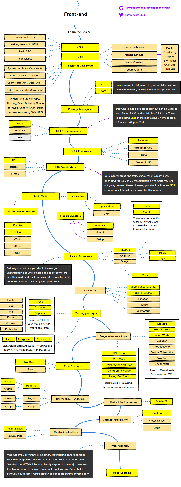

# 第2章-前端开发实践-概述

初学者如何成为前端开发工程师？嗯，这很复杂，先来看看这张线路图：

时至今日，我们依旧不能通过大学课堂得到一份前端开发工程师的学位，而且我很少听说有前端开发者在拿到计算机科学学位/视觉设计学位后就能立刻编写出专业的 HTML、CSS、JavaScript 代码。据我所见，今天的大部分前端从业者似乎都是自学成才的，或者从计算机科学领域/视觉设计领域转入前端领域的。

If you were to set out today to become a front-end developer I would loosely strive to follow the process outlined below \(Chapter 3 and Chapter 4 will dive into more details on learning resources\).如果你希望从今天开始前端之旅，希望你能够大致遵循下面列出的具体流程（第 3 章和第 4 章将深入展开每项，并介绍更多相关学习资源）。

1. 大致了解 Web 平台的工作原理，确保你能理解[HTML, CSS, DOM, JavaScript, 域名, DNS, URLs, HTTP, 浏览器, and servers/hosting](https://developer.mozilla.org/en-US/docs/Learn/Getting_started_with_the_web). Don't dive deep on anything just yet, just aim to understand the parts at play and how they loosely fit together. Start by building simple web pages.
2. [Learn HTML](https://developer.mozilla.org/en-US/docs/Learn/HTML)
3. [Learn CSS](https://developer.mozilla.org/en-US/docs/Learn/CSS)
4. [Learn JavaScript](https://youtu.be/QjKH1J77gjI?list=PL055Epbe6d5bQubu5EWf_kUNA3ef_qbmL)
5. Learn DOM
6. Learn the fundamentals of user interface design \(i.e. UI patterns, interaction design, user experience design, and usability\).
7. Learn CLI/command line
8. Learn the practice of software engineering \(i.e., Application design/architecture, templates, Git, testing, monitoring, automating, code quality, development methodologies\).
9. Get opinionated and customize your tool box with whatever makes sense to your brain \(e.g. Webpack, React, and Mobx\).
10. Learn Node.js

A short word of advice on learning.[Learn the actual underlying technologies, before learning abstractions.](https://youtu.be/QjKH1J77gjI?list=PL055Epbe6d5bQubu5EWf_kUNA3ef_qbmL)Don't learn jQuery, learn the DOM. Don't learn SASS, learn CSS. Don't learn JSX, learn HTML. Don't learn TypeScript, learn JavaScript. Don't learn Handlebars, learn JavaScript ES6 templates. Don't just use Bootstrap, learn UI patterns.

Lately a lot of non-accredited, expensive, front-end code schools/bootcamps have emerged. These avenues of becoming a front-end developer are typically teacher directed courses, that follow a more traditional style of learning, from an official instructor \(i.e., syllabus, test, quizzes, projects, team projects, grades, etc.\).

Keep in mind, if you are considering an expensive training program, this is the web! Everything you need to learn is on the web for the taking, costing little to nothing. However, if you need someone to tell you how to take and learn what is low cost to free, and hold you accountable for learning it, you should consider a traditional instructor lead class room setting. Otherwise, I am not aware of any other profession that is practically free for the taking with an internet connection, a[couple of dollars a month for screencasting memberships](https://frontendmasters.com/join/), and a burning desire for knowledge.

For example, if you want to get going today, consuming one or more of the following self-directed resources below can work:

* [Getting started with the Web](https://developer.mozilla.org/en-US/docs/Learn/Getting_started_with_the_web)

  \[read\]

* [So, You Want to be a Front-End Engineer](https://www.youtube.com/watch?v=Lsg84NtJbmI)

  \[watch\]

* [Frontend Masters Learning Paths](https://frontendmasters.com/learn)

  \[watch\]\[$\]

* [Introduction to Web Development](https://frontendmasters.com/courses/web-development-v2/)

  \[watch\]\[$\]

* [Treehouse Techdegree](https://teamtreehouse.com/techdegree/front-end-web-development-2)

  \[watch\]\[$\]

* [Front-End Web Developer Nanodegree](https://www.udacity.com/course/front-end-web-developer-nanodegree--nd001)

  \[watch\]\[$\]

* [Become a Front-End Web Developer](https://www.lynda.com/learning-paths/Web/become-a-front-end-web-developer)

  \[watch\]\[$\]

* [freeCodeCamp](https://learn.freecodecamp.org/)

  \[interactive\]\[watch\]

When getting your start, you should fear most things that conceal complexity. Abstractions \(e.g. jQuery\) in the wrong hands can give the appearance of advanced skills, while all the time hiding the fact that a developer has an inferior understanding of the basics or underlying concepts.

It is assumed that on this journey you are not only learning, but also doing as you learn and investigate tools. Some suggest only doing to learn. While others suggest only learning about doing. I suggest you find a mix of both that matches how your brain works and do that. But, for sure, it is a mix! So, don't just read about it, do it. Learn, do. Learn, do. Repeat indefinitely because things change fast. This is why learning the fundamentals, and not abstractions, are so important.

